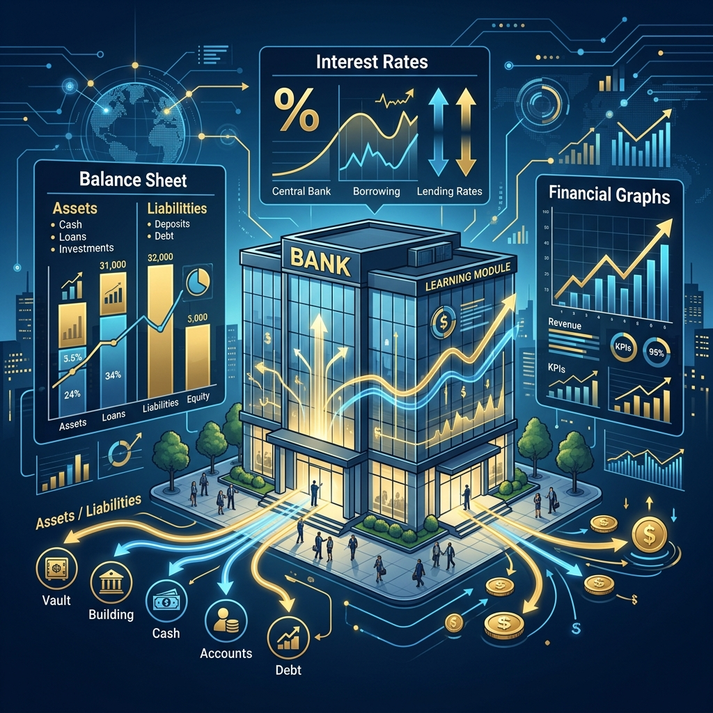
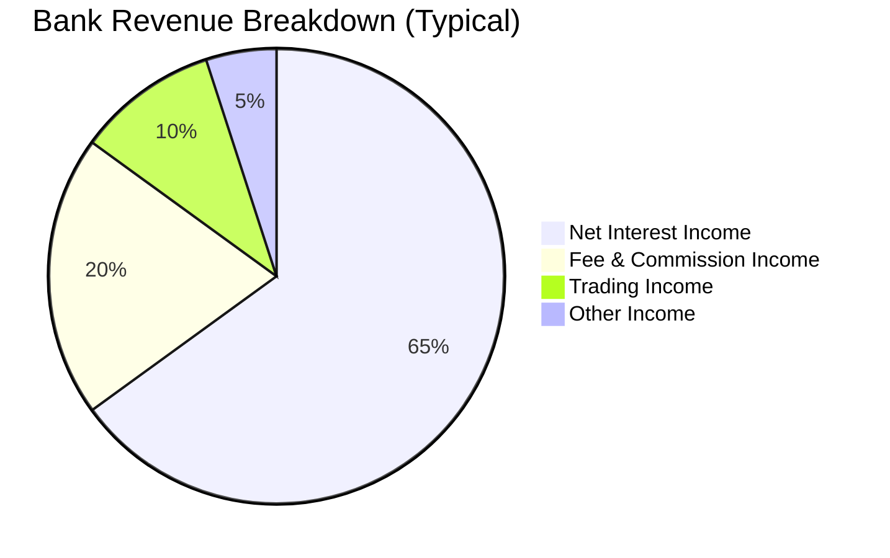
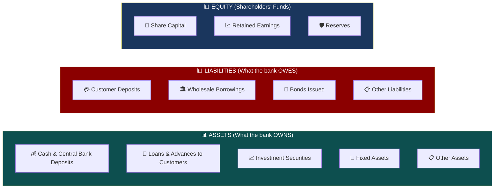
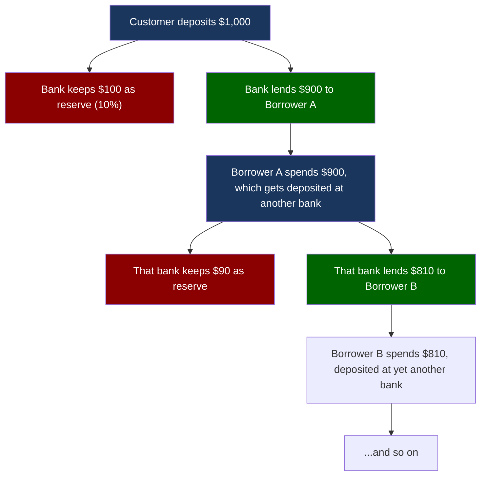
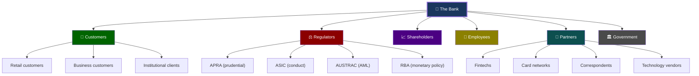

# Module 01: Banking Fundamentals



> **Learning Objective**: Understand what a bank is, the different types of banks, how they generate revenue, and the fundamental concepts that underpin the entire banking system.

---

## Table of Contents

- [1.1 What Is a Bank?](#11-what-is-a-bank)
- [1.2 Types of Banks](#12-types-of-banks)
- [1.3 How Banks Make Money](#13-how-banks-make-money)
- [1.4 The Bank Balance Sheet](#14-the-bank-balance-sheet)
- [1.5 Fractional Reserve Banking](#15-fractional-reserve-banking)
- [1.6 The Banking Value Chain](#16-the-banking-value-chain)
- [1.7 Key Stakeholders](#17-key-stakeholders-in-a-bank)
- [1.8 Key Takeaways](#18-key-takeaways)

---

## 1.1 What Is a Bank?

A **bank** is a licensed financial institution that performs three core functions:

1. **Accepts deposits** — Takes money from customers and holds it safely
2. **Makes loans** — Lends money to individuals and businesses at interest
3. **Facilitates payments** — Enables money to move between parties

> **Think of it this way**: A bank is an intermediary that connects people who have surplus money (depositors) with people who need money (borrowers). The bank earns the difference in interest rates.

### The Fundamental Banking Equation

```
Bank's Profit = Interest Earned on Loans − Interest Paid on Deposits − Operating Costs + Fees
```

This simple equation drives the entire industry. Every product, service, and innovation in banking ultimately connects back to this formula.

---

## 1.2 Types of Banks

```mermaid
graph TD
    BANK["🏦 Types of Financial Institutions"]
    BANK --> CB["Central Bank"]
    BANK --> RETAIL["Retail Bank"]
    BANK --> COMM["Commercial Bank"]
    BANK --> INV["Investment Bank"]
    BANK --> NEO["Neo/Digital Bank"]
    BANK --> CU["Credit Union"]
    BANK --> PRIV["Private Bank"]
    
    CB --> CB1["Sets monetary policy"]
    CB --> CB2["Lender of last resort"]
    CB --> CB3["Issues currency"]
    
    RETAIL --> R1["Serves individuals"]
    RETAIL --> R2["Savings, loans, cards"]
    
    COMM --> C1["Serves businesses"]
    COMM --> C2["Trade finance, treasury"]
    
    INV --> I1["Capital markets"]
    INV --> I2["M&A, IPO, trading"]
    
    NEO --> N1["Digital-only"]
    NEO --> N2["No physical branches"]
    
    style BANK fill:#1a365d,color:#fff,stroke:#4a90d9
    style CB fill:#8b0000,color:#fff
    style RETAIL fill:#006400,color:#fff
    style COMM fill:#00008b,color:#fff
    style INV fill:#4b0082,color:#fff
    style NEO fill:#ff6347,color:#fff
    style CU fill:#2e8b57,color:#fff
    style PRIV fill:#8b4513,color:#fff
```



### Detailed Comparison

| Type | Customers | Key Products | Examples | Revenue Source |
|------|-----------|-------------|----------|----------------|
| **Central Bank** | Government, banks | Monetary policy, currency | RBA, Federal Reserve, ECB | Seigniorage, interest on reserves |
| **Retail Bank** | Individuals, families | Savings, mortgages, credit cards | NAB, CBA, Westpac | Net Interest Margin (NIM), fees |
| **Commercial Bank** | SMEs, corporations | Business loans, trade finance, cash management | NAB Business, ANZ Corporate | NIM, transaction fees, FX |
| **Investment Bank** | Corporates, institutions | IPOs, M&A advisory, securities trading | Macquarie, Goldman Sachs | Advisory fees, trading gains |
| **Neo/Digital Bank** | Tech-savvy consumers | App-based accounts, payments | Up Bank, Revolut, Judo Bank | Interchange fees, subscriptions |
| **Credit Union** | Members (mutual) | Savings, personal loans | Credit Union Australia | NIM (lower margins, member-focused) |
| **Private Bank** | High-net-worth individuals | Wealth management, estate planning | UBS, NAB Private Wealth | Management fees, commissions |

> **NAB Context**: NAB is a **universal bank** — it operates across retail, commercial, and institutional banking. It's one of Australia's "Big 4" banks (CBA, Westpac, ANZ, NAB).

---

## 1.3 How Banks Make Money

Banks have **four primary revenue streams**:



### 1.3.1 Net Interest Income (NII)

The **largest** revenue source. This is the difference between:
- **Interest earned** on loans and investments
- **Interest paid** on deposits and borrowings

**Net Interest Margin (NIM)** = (Interest Income − Interest Expense) / Average Earning Assets

| Metric | Typical Value | What It Means |
|--------|--------------|---------------|
| NIM for Australian Big 4 | 1.5% – 2.0% | For every $100 in loans, the bank earns ~$1.75 net |
| Cost of Funds | 2.0% – 4.0% | What the bank pays depositors/bondholders |
| Lending Rate | 4.0% – 7.0% | What borrowers pay the bank |

> **Example**: NAB takes a deposit at 3.5% interest and lends it out as a mortgage at 6.0%. The **spread** of 2.5% is the gross margin before operating costs.

### 1.3.2 Fee & Commission Income

| Fee Type | Description | Example |
|----------|-------------|---------|
| **Account fees** | Monthly/annual account charges | $10/month business account fee |
| **Transaction fees** | Per-transaction charges | ATM withdrawal fee, wire transfer fee |
| **Interchange fees** | Fees from card transactions | 0.3% – 1.5% of each card purchase |
| **Loan origination fees** | Upfront fee for loan setup | $600 mortgage establishment fee |
| **Wealth management fees** | Portfolio management charges | 0.5% – 1.5% of assets under management |
| **FX fees** | Currency conversion margins | 1% – 3% spread on exchange rates |

### 1.3.3 Trading Income

Investment and institutional banks earn from:
- **Proprietary trading** — Trading the bank's own money in markets
- **Market making** — Providing liquidity and earning the bid-ask spread
- **FX trading** — Currency exchange for customers and on own account

### 1.3.4 Other Income

- Insurance premiums (bancassurance)
- Dividend income from investments
- Gains on sale of assets
- Advisory and consulting fees

---

## 1.4 The Bank Balance Sheet

Understanding a bank's balance sheet is **critical** for domain knowledge. It's fundamentally different from a non-financial company.



### The Balance Sheet Equation

```
Assets = Liabilities + Equity
```

**A bank's loans are its ASSETS** (money owed TO the bank), and **customer deposits are its LIABILITIES** (money the bank owes TO customers). This is the opposite of what most people initially think!

### Simplified Bank Balance Sheet

| Assets (Uses of Funds) | $B | Liabilities & Equity (Sources of Funds) | $B |
|------------------------|-----|----------------------------------------|-----|
| Cash & equivalents | 50 | Customer deposits | 500 |
| Loans to customers | 600 | Wholesale funding | 150 |
| Investment securities | 150 | Bonds/notes issued | 100 |
| Fixed assets | 20 | Other liabilities | 30 |
| Other assets | 30 | **Total Liabilities** | **780** |
| | | Shareholders' equity | 70 |
| **Total Assets** | **850** | **Total Liabilities + Equity** | **850** |

> **Key Insight**: Notice how **loans** (600B) are by far the largest asset, and **deposits** (500B) are the largest liability. The **equity** (70B) is relatively small — banks are highly leveraged businesses. A typical bank has a leverage ratio of 10-15x.

### Key Balance Sheet Ratios

| Ratio | Formula | Typical Value | Significance |
|-------|---------|---------------|-------------|
| **Capital Adequacy Ratio (CAR)** | Regulatory Capital / Risk-Weighted Assets | >10.5% | Minimum required by regulators |
| **Loan-to-Deposit Ratio (LDR)** | Total Loans / Total Deposits | 80%–100% | How much of deposits are lent out |
| **Liquidity Coverage Ratio (LCR)** | High-Quality Liquid Assets / Net Cash Outflows (30 days) | >100% | Can survive 30-day stress |
| **Net Stable Funding Ratio (NSFR)** | Available Stable Funding / Required Stable Funding | >100% | Long-term funding stability |
| **Leverage Ratio** | Tier 1 Capital / Total Exposure | >3% | Cap on overall leverage |

---

## 1.5 Fractional Reserve Banking

This is the **foundational mechanism** of modern banking.

### How It Works

When you deposit $1,000 in a bank, the bank doesn't keep all of it in a vault. It keeps a **fraction** (the reserve) and lends out the rest.



### The Money Multiplier

The initial $1,000 deposit creates much more money in the economy:

```
Money Multiplier = 1 / Reserve Ratio
If Reserve Ratio = 10%, then Multiplier = 10x
So $1,000 deposit → up to $10,000 in total money supply
```

| Round | Deposit | Reserve (10%) | Loan |
|-------|---------|--------------|------|
| 1 | $1,000.00 | $100.00 | $900.00 |
| 2 | $900.00 | $90.00 | $810.00 |
| 3 | $810.00 | $81.00 | $729.00 |
| 4 | $729.00 | $72.90 | $656.10 |
| 5 | $656.10 | $65.61 | $590.49 |
| ... | ... | ... | ... |
| **Total** | **$10,000** | **$1,000** | **$9,000** |

> **Modern Reality**: In practice, central banks like the RBA don't enforce a strict reserve ratio for Australian banks. Instead, they use **capital adequacy requirements** (Basel III) and **liquidity ratios** to ensure stability.

---

## 1.6 The Banking Value Chain

Every banking activity can be mapped to this value chain:


### Value Chain Activities

| Office | Function | Description | Systems Used |
|--------|----------|-------------|-------------|
| **Front Office** | Customer-facing | Where revenue is generated. Sales, advisory, and relationship management | CRM, Digital Banking Channels |
| **Middle Office** | Risk & Control | Monitors and manages risk, ensures regulatory compliance | Risk engines, Compliance tools |
| **Back Office** | Processing | Executes transactions, settlements, and handles operations | Core Banking, Payment gateways |
| **Support** | Infrastructure | IT, HR, Legal, Finance — enables all other functions | ERP, ITSM, Data platforms |

---

## 1.7 Key Stakeholders in a Bank



### Stakeholder Interests

| Stakeholder | Primary Interest | What They Monitor |
|-------------|-----------------|-------------------|
| **Customers** | Safe, convenient, affordable banking | Rates, fees, digital experience |
| **Regulators** | Systemic stability, consumer protection | Capital ratios, compliance, conduct |
| **Shareholders** | Return on investment | ROE, dividends, share price |
| **Employees** | Fair compensation, career growth | Culture, remuneration, training |
| **Partners** | Revenue sharing, platform access | API availability, partnership terms |
| **Government** | Economic stability, tax revenue | Lending volumes, employment, taxes |

---

## 1.8 Key Takeaways

> [!IMPORTANT]
> **Core Concepts to Remember**:
> 1. Banks are **intermediaries** — they connect savers and borrowers
> 2. **NIM (Net Interest Margin)** is the primary revenue driver
> 3. A bank's **loans are assets**, and **deposits are liabilities** — counterintuitive!
> 4. Banks are **highly leveraged** — small equity relative to total assets
> 5. Banks operate through **front/middle/back office** functions
> 6. **Regulators** play a central role in banking — more so than almost any other industry
> 7. The **balance sheet** is the single most important document for understanding a bank

### Common Vocabulary from This Module

| Term | Definition |
|------|-----------|
| **NIM** | Net Interest Margin — the spread between lending and funding rates |
| **NII** | Net Interest Income — absolute dollar income from interest spread |
| **CAR** | Capital Adequacy Ratio — regulatory measure of a bank's capital buffer |
| **LDR** | Loan-to-Deposit Ratio — how much of deposits are deployed as loans |
| **Leverage** | Total assets relative to equity — banks typically 10–15x leveraged |
| **Spread** | The difference between two interest rates (e.g., lending rate minus deposit rate) |
| **Book value** | A bank's equity value as shown on the balance sheet |
| **Universal bank** | A bank that offers retail, commercial, AND investment banking services |

---

**Next**: [Module 02 — Core Banking Operations →](./02-core-banking-operations.md)
