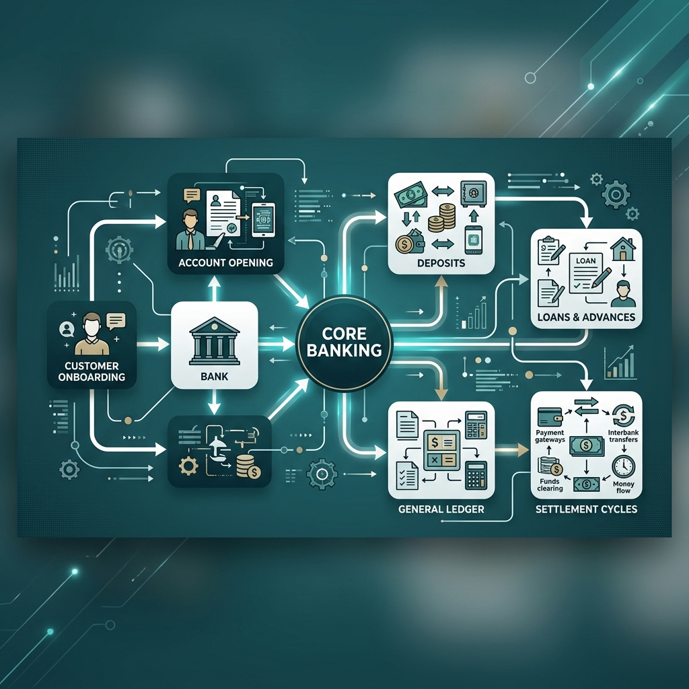
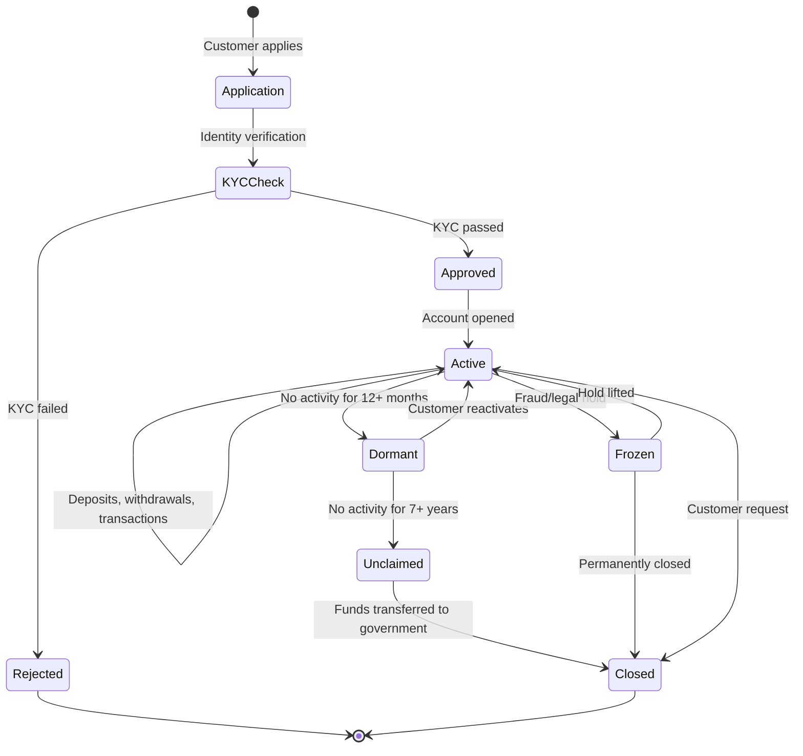
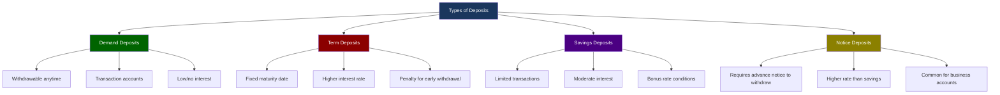
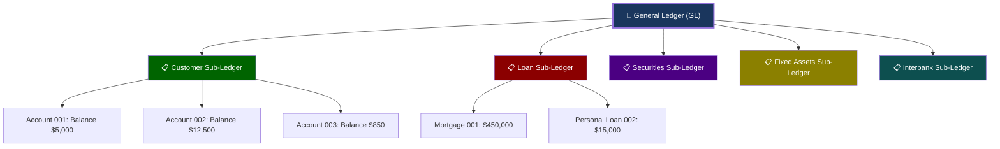
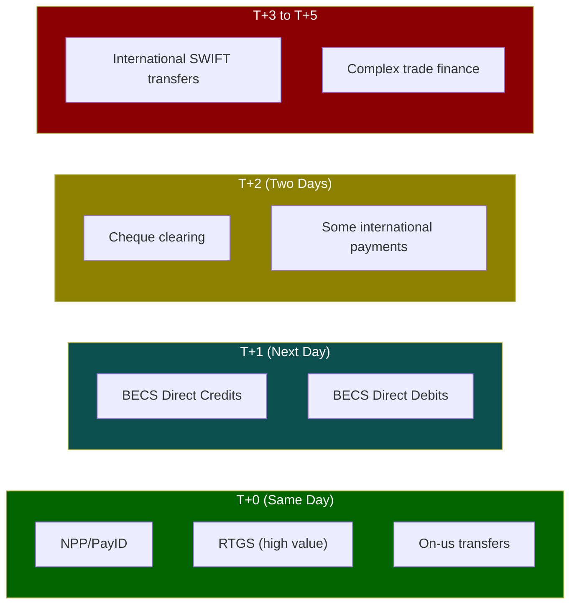
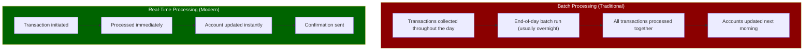

# Module 02: Core Banking Operations



> **Learning Objective**: Understand the fundamental operations that drive a bank's day-to-day activities — from opening an account to processing loans, managing ledgers, and settling transactions.

---

## Table of Contents

- [2.1 Account Lifecycle](#21-account-lifecycle)
- [2.2 Deposits & Withdrawals](#22-deposits--withdrawals)
- [2.3 The Lending Lifecycle](#23-the-lending-lifecycle)
- [2.4 Interest Calculation](#24-interest-calculation)
- [2.5 General Ledger & Double-Entry Bookkeeping](#25-general-ledger--double-entry-bookkeeping)
- [2.6 Settlement & Clearing](#26-settlement--clearing)
- [2.7 Batch vs Real-Time Processing](#27-batch-vs-real-time-processing)
- [2.8 Key Takeaways](#28-key-takeaways)

---

## 2.1 Account Lifecycle

Every banking relationship starts with an **account**. Understanding the account lifecycle is foundational.



### Account Lifecycle Stages

| Stage | Description | Duration | Key Activities |
|-------|-------------|----------|----------------|
| **Application** | Customer submits application with ID documents | 1–5 days | Form filling, document upload |
| **KYC Check** | Bank verifies identity, address, source of funds | 1–7 days | ID verification, PEP/sanctions screening |
| **Active** | Account operational for transactions | Ongoing | Deposits, withdrawals, payments |
| **Dormant** | No customer-initiated transactions | After 12 months | Bank sends reactivation notices |
| **Unclaimed** | No activity, customer unreachable | After 7 years (AU) | Funds escheated to ASIC |
| **Frozen** | Legally restricted account | Variable | Court orders, fraud investigation |
| **Closed** | Account terminated | Permanent | Final settlement, records archived |

### Account Types

| Account Type | Purpose | Interest? | Key Features |
|-------------|---------|-----------|-------------|
| **Transaction Account** (Checking) | Day-to-day spending | Minimal/none | Debit card, direct debits, unlimited transactions |
| **Savings Account** | Earning interest on balances | Yes | Limited transactions, bonus interest conditions |
| **Term Deposit** | Fixed-term investment | Yes (higher) | Locked for 1–60 months, penalty for early exit |
| **Offset Account** | Reduce mortgage interest | No (reduces loan interest) | Linked to home loan, balance offsets mortgage |
| **Business Account** | Company operations | Varies | Merchant facilities, payroll, invoicing |
| **Trust Account** | Hold funds on behalf of others | Varies | Lawyers, real estate agents, regulatory requirements |

> **Australian Context**: In Australia, a **BSB (Bank-State-Branch) number** + **Account Number** uniquely identifies any bank account. BSB is a 6-digit code (e.g., 083-004 for NAB Melbourne). This is unique to Australia — other countries use IBAN or routing numbers.

---

## 2.2 Deposits & Withdrawals

### Types of Deposits



### Deposit Operations

| Operation | Description | Processing Time | What Happens Behind the Scenes |
|-----------|-------------|----------------|-------------------------------|
| **Cash deposit** | Physical cash into account | Immediate | Teller/ATM credits customer account, general ledger updated |
| **Direct credit** | Employer pays salary | Same day (batch) | Payroll file sent via BECS, batch processed overnight |
| **Transfer in** | From another bank | 1–2 days (BECS) or instant (NPP) | Clearing through payment network |
| **Cheque deposit** | Paper cheque lodged | 3–5 business days | Cheque sent for clearing, presentment to paying bank |
| **International wire** | From overseas bank | 1–5 days | SWIFT message, correspondent banking chain |

### Withdrawal Operations

| Operation | Limits | Method |
|-----------|--------|--------|
| **ATM withdrawal** | $2,000/day typical | Card + PIN |
| **EFTPOS** | Merchant-dependent | Card + PIN/tap |
| **Online transfer** | $10,000–$250,000/day | Internet/mobile banking |
| **Over-the-counter** | $10,000+ requires reporting | Branch, ID required |
| **Direct debit** | As authorized by customer | DDR (Direct Debit Request) agreement |

> [!NOTE]
> **Threshold Transaction Reporting**: In Australia, any cash transaction of **$10,000 or more** must be reported to **AUSTRAC** (Australian Transaction Reports and Analysis Centre) under the AML/CTF Act.

---

## 2.3 The Lending Lifecycle

Lending is where banks make most of their money. Understanding this lifecycle is critical.


### Credit Assessment — The 5 Cs

Banks evaluate borrowers using the **5 Cs of Credit**:

| C | What It Means | How It's Assessed |
|---|--------------|-------------------|
| **Character** | Borrower's credit history and reputation | Credit score (Equifax/Illion), repayment history |
| **Capacity** | Ability to repay the loan | Income verification, debt-to-income ratio, expenses |
| **Capital** | Borrower's own financial contribution | Deposit/down payment, savings history |
| **Collateral** | Security pledged against the loan | Property valuation, asset assessment |
| **Conditions** | Purpose of loan and economic environment | Loan purpose, market conditions, industry outlook |

### Credit Scoring

| Score Range (Equifax AU) | Rating | Outcome |
|--------------------------|--------|---------|
| 833–1200 | Excellent | Best rates, fast approval |
| 726–832 | Very Good | Competitive rates |
| 622–725 | Good | Standard rates |
| 510–621 | Average | Higher rates, more scrutiny |
| 0–509 | Below Average | May be declined or referred |

### Loan Classification & Provisioning

Banks must classify their loan portfolio by quality:

| Classification | Days Past Due | Provision Required | Description |
|---------------|--------------|-------------------|-------------|
| **Performing** | 0 days | Stage 1 (12-month ECL) | Loan is being repaid as agreed |
| **Watch** | 1–30 days | Stage 1 | Minor delay, still expected to recover |
| **Substandard** | 31–60 days | Stage 2 (Lifetime ECL) | Significant increase in credit risk |
| **Doubtful** | 61–90 days | Stage 2 | Repayment is doubtful |
| **Loss/Default** | 90+ days | Stage 3 (Lifetime ECL, impaired) | Unlikely to be recovered, written down |

> **ECL** = Expected Credit Loss. Under **AASB 9** (Australian accounting standard based on IFRS 9), banks must recognize expected losses proactively, not just when they occur.

### Key Lending Metrics

| Metric | Formula | Significance |
|--------|---------|-------------|
| **LVR** (Loan-to-Value Ratio) | Loan Amount / Property Value × 100 | >80% requires LMI in Australia |
| **DTI** (Debt-to-Income) | Total Debt / Gross Income | Used by APRA to set lending limits |
| **DSR** (Debt Service Ratio) | Annual Debt Payments / Annual Income | Measures repayment burden |
| **NPL Ratio** | Non-Performing Loans / Total Loans | Indicator of portfolio quality |
| **Coverage Ratio** | Loan Loss Provisions / NPLs | How well provisioned the bank is |

---

## 2.4 Interest Calculation

### Simple vs Compound Interest

**Simple Interest**:
```
Interest = Principal × Rate × Time
Example: $10,000 × 5% × 2 years = $1,000
```

**Compound Interest** (what banks actually use):
```
Amount = Principal × (1 + Rate/n)^(n×t)
Where n = compounding frequency
Example: $10,000 × (1 + 0.05/12)^(12×2) = $11,049.41
```

### Key Interest Rate Terms

| Term | Definition | Example |
|------|-----------|---------|
| **Nominal Rate** | The stated annual interest rate | "5.5% p.a." |
| **Effective Rate (APR/APY)** | The actual annual rate including compounding | 5.64% when compounded monthly |
| **Comparison Rate** | Rate that includes fees (Australian requirement) | 5.85% after including $300 annual fee |
| **Cash Rate** | The RBA's target interest rate | 4.10% (set by RBA board monthly) |
| **Variable Rate** | Changes with market conditions | Moves with RBA cash rate |
| **Fixed Rate** | Locked for a set period | Fixed at 5.99% for 3 years |
| **Base Rate** | Bank's standard rate before discounts | 6.49% base rate |
| **Discount/Margin** | Reduction from base rate | 0.50% discount for loyal customers |

### How Mortgage Interest Works (Daily Calculation)

Australian mortgages typically calculate interest **daily** on the outstanding balance:

```
Daily Interest = Outstanding Balance × Annual Rate / 365
Example: $500,000 × 6.0% / 365 = $82.19 per day
Monthly Interest (30 days) = $82.19 × 30 = $2,465.75
```

> **Offset Account Impact**: If you have $50,000 in an offset account linked to a $500,000 mortgage:
> - Interest is charged on $500,000 - $50,000 = $450,000
> - Daily interest drops from $82.19 to $73.97
> - Annual saving: ~$3,000

---

## 2.5 General Ledger & Double-Entry Bookkeeping

### The General Ledger (GL)

The **General Ledger** is the master record of ALL financial transactions in a bank. Think of it as the bank's single source of truth.



### Double-Entry Bookkeeping

**Every transaction has TWO entries** — a debit and a credit that must balance.

| Rule | Debit Increases | Credit Increases |
|------|----------------|-----------------|
| **Assets** | ✅ Debit | ❌ Credit |
| **Liabilities** | ❌ Credit | ✅ Debit |
| **Equity** | ❌ Credit | ✅ Debit |
| **Income** | ❌ Credit | ✅ Debit |
| **Expenses** | ✅ Debit | ❌ Credit |

### Transaction Examples

**Example 1: Customer deposits $1,000 cash**

| Account | Debit | Credit |
|---------|-------|--------|
| Cash (Asset) | $1,000 | |
| Customer Deposit (Liability) | | $1,000 |

*Why?* The bank's cash increases (asset up = debit), and its obligation to the customer increases (liability up = credit).

**Example 2: Bank grants a $500,000 mortgage**

| Account | Debit | Credit |
|---------|-------|--------|
| Loan Receivable (Asset) | $500,000 | |
| Customer's Transaction Account (Liability) | | $500,000 |

*Why?* The bank now has a loan asset, and the customer's account is credited with the funds.

**Example 3: Customer pays $2,500 monthly mortgage payment**

| Account | Debit | Credit |
|---------|-------|--------|
| Customer's Account (Liability) | $2,500 | |
| Loan Receivable (Asset) | | $2,000 |
| Interest Income (Revenue) | | $500 |

*Why?* Customer's deposit decreases, the loan principal reduces, and the bank recognizes interest income.

---

## 2.6 Settlement & Clearing

### Understanding the Difference

| Concept | Definition | Example |
|---------|-----------|---------|
| **Clearing** | The process of transmitting, reconciling, and confirming payment instructions | Visa processes the card transaction between banks |
| **Settlement** | The actual transfer of money between banks to complete the transaction | RBA moves funds between bank settlement accounts |
| **Finality** | The point at which the transaction is irrevocable | Once settled in RITS, the payment is final |

### Settlement Cycles



| Settlement Type | Speed | Used For | Risk |
|----------------|-------|----------|------|
| **RTGS** (Real-Time Gross Settlement) | Immediate, individual | High-value (>$100K), interbank | Lowest — settled in real-time at RBA |
| **DNS** (Deferred Net Settlement) | End of day, batched | Low-value, high-volume | Higher — net positions settled |
| **NPP** (New Payments Platform) | Near real-time | Consumer/business payments | Low — fast settlement through RITS |
| **Bilateral netting** | Periodic | Interbank obligations | Moderate — reduces gross flows |

### On-Us vs Off-Us Transactions

| Type | Description | Example | Settlement |
|------|-------------|---------|------------|
| **On-us** | Both parties bank with the same institution | NAB customer transfers to NAB customer | Internal ledger update, no external settlement |
| **Off-us** | Parties bank with different institutions | NAB customer transfers to CBA customer | Goes through payment network, requires clearing & settlement |

---

## 2.7 Batch vs Real-Time Processing

### How Banks Have Traditionally Processed



### Comparison

| Aspect | Batch Processing | Real-Time Processing |
|--------|-----------------|---------------------|
| **Speed** | Hours (overnight) | Seconds |
| **Cost per transaction** | Lower (economies of scale) | Higher (per-message processing) |
| **Customer experience** | "Pending" transactions | Instant confirmation |
| **Risk** | Settlement risk during batch window | Lower — immediate finality |
| **Error handling** | Errors caught in batch, fixed next day | Errors handled immediately |
| **Use cases** | Payroll, direct debits, interest calculation | Card payments, NPP transfers, FX |
| **Technology** | Mainframe-era systems | Event-driven, microservices |

> **Industry Trend**: The banking industry is moving toward **24/7 real-time processing**, driven by customer expectations and payment schemes like NPP. However, many back-office processes (interest calculation, regulatory reporting, reconciliation) still run in batch.

### End-of-Day (EOD) Processing

Banks run a critical **End-of-Day batch** process every business day. This includes:

1. **Interest accrual** — Calculate and apply daily interest on all accounts
2. **Fee charging** — Apply monthly/annual fees
3. **Direct debit processing** — Process standing instructions
4. **Reconciliation** — Match internal records with external systems
5. **Regulatory reporting** — Generate APRA, RBA, AUSTRAC reports
6. **GL posting** — Post all transactions to the General Ledger
7. **Statement generation** — Create customer statements
8. **Risk calculations** — Update credit risk models, provisioning

---

## 2.8 Key Takeaways

> [!IMPORTANT]
> **Core Concepts to Remember**:
> 1. Accounts have a **lifecycle** — from application through KYC to active to eventual closure
> 2. The **5 Cs of Credit** guide all lending decisions (Character, Capacity, Capital, Collateral, Conditions)
> 3. **Double-entry bookkeeping** means every transaction has two sides — always
> 4. **Clearing** is matching and confirming; **Settlement** is moving the actual money
> 5. Banks are transitioning from **batch to real-time**, but batch processing remains critical
> 6. Australian accounts use **BSB + Account Number** for identification

### Common Vocabulary from This Module

| Term | Definition |
|------|-----------|
| **BSB** | Bank-State-Branch number — 6-digit identifier unique to Australian banking |
| **KYC** | Know Your Customer — identity verification process |
| **LVR** | Loan-to-Value Ratio — loan amount as percentage of property value |
| **LMI** | Lenders Mortgage Insurance — required when LVR exceeds 80% |
| **NPL** | Non-Performing Loan — loan in default or close to default |
| **ECL** | Expected Credit Loss — forward-looking provision for potential losses |
| **GL** | General Ledger — master record of all financial transactions |
| **EOD** | End of Day — batch processing cycle run nightly |
| **RTGS** | Real-Time Gross Settlement — immediate settlement of individual payments |
| **On-us** | Transaction where both parties bank with the same institution |

---

**Previous**: [← Module 01 — Banking Fundamentals](./01-banking-fundamentals.md)  
**Next**: [Module 03 — Banking Products & Services →](./03-banking-products-services.md)
