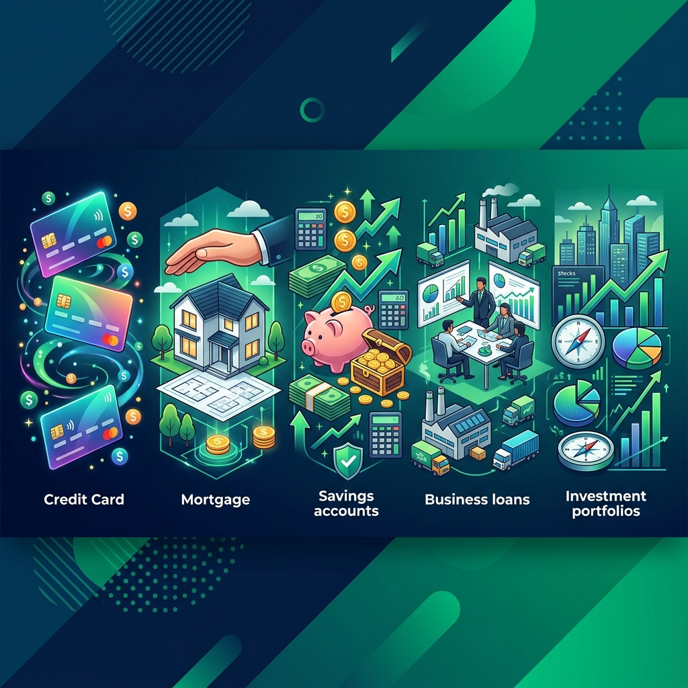
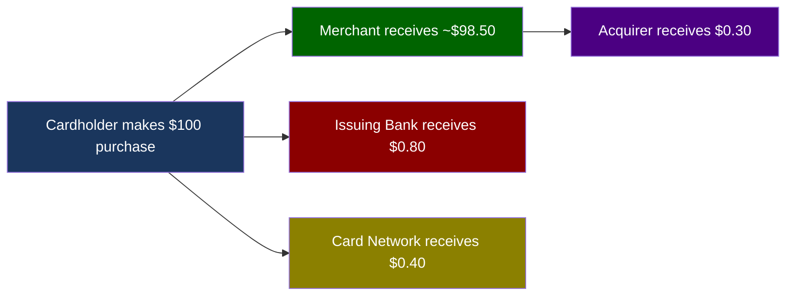
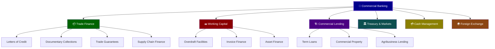
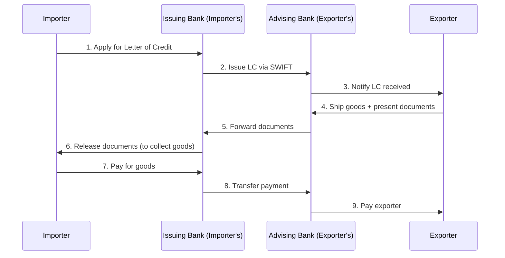

# Module 03: Banking Products & Services

> **Learning Objective**: Understand the complete catalog of banking products across retail, commercial, investment, and wealth management — and how each product generates revenue for the bank.

---

## Table of Contents

- [3.1 Retail Banking Products](#31-retail-banking-products)
- [3.2 Commercial/Business Banking](#32-commercialbusiness-banking)
- [3.3 Institutional & Investment Banking](#33-institutional--investment-banking)
- [3.4 Wealth Management](#34-wealth-management)
- [3.5 Insurance & Bancassurance](#35-insurance--bancassurance)
- [3.6 Digital & Emerging Products](#36-digital--emerging-products)
- [3.7 Key Takeaways](#37-key-takeaways)

---

## 3.1 Retail Banking Products

Retail banking serves **individual consumers**. It's the largest customer segment by number.

```mermaid
graph TD
    RB["🏪 Retail Banking Products"]
    RB --> DEP["💰 Deposit Products"]
    RB --> LEND["🏠 Lending Products"]
    RB --> CARDS["💳 Card Products"]
    RB --> INS["🛡️ Insurance"]
    RB --> INVEST["📈 Investment"]
    
    DEP --> DEP1["Transaction Account"]
    DEP --> DEP2["Savings Account"]
    DEP --> DEP3["Term Deposit"]
    DEP --> DEP4["Offset Account"]
    
    LEND --> LEND1["Home Loan / Mortgage"]
    LEND --> LEND2["Personal Loan"]
    LEND --> LEND3["Car Loan"]
    LEND --> LEND4["Line of Credit"]
    
    CARDS --> CARDS1["Debit Card"]
    CARDS --> CARDS2["Credit Card"]
    CARDS --> CARDS3["Prepaid Card"]
    
    INS --> INS1["Home Insurance"]
    INS --> INS2["Life Insurance"]
    
    INVEST --> INV1["Managed Funds"]
    INVEST --> INV2["Superannuation"]
    
    style RB fill:#1a365d,color:#fff,stroke-width:3px
    style DEP fill:#006400,color:#fff
    style LEND fill:#8b0000,color:#fff
    style CARDS fill:#4b0082,color:#fff
    style INS fill:#0d4f4f,color:#fff
    style INVEST fill:#8b8000,color:#fff
```

### 3.1.1 Deposit Products

| Product | Interest Rate | Access | Best For | Bank Revenue |
|---------|-------------|--------|----------|-------------|
| **Transaction Account** | 0% – 0.5% | Unlimited | Day-to-day banking | Account fees, interchange |
| **Online Savings** | 4.0% – 5.5% | Limited (e.g., 1 free/month) | Short-term savings | NIM (lend at higher rate) |
| **Term Deposit** | 4.5% – 5.5% | Locked (1–60 months) | Fixed investment | NIM, guaranteed funding |
| **Offset Account** | No interest paid | Linked to mortgage | Mortgage reduction strategy | Mortgage interest (net) |

### 3.1.2 Home Loans / Mortgages

The **largest** retail banking product by value. Mortgages are the backbone of Australian banking.

| Feature | Variable Rate | Fixed Rate | Split Loan |
|---------|-------------|------------|------------|
| **Rate** | Moves with market | Locked for 1–5 years | Part variable, part fixed |
| **Flexibility** | Extra repayments OK | Limited extra repayments | Mixed flexibility |
| **Offset** | Available | Usually not | On variable portion |
| **Break cost** | None | Can be significant | On fixed portion |
| **Who it suits** | Those who want flexibility | Those who want certainty | Best of both worlds |

**Mortgage Structure in Australia**:

| Term | Meaning | Typical Value |
|------|---------|---------------|
| **Loan Term** | Total repayment period | 25–30 years |
| **LVR** | Loan-to-Value Ratio | 60%–95% |
| **LMI** | Lenders Mortgage Insurance | Required if LVR > 80% |
| **P&I** | Principal & Interest repayment | Most common — pays down debt |
| **IO** | Interest Only repayment | Pays only interest — popular with investors |
| **Redraw** | Access to extra repayments made | Available on most variable loans |
| **Guarantor** | Third party guarantees part of loan | Parents helping first home buyers |

### 3.1.3 Credit Cards

**How the bank makes money from credit cards**:

| Revenue Stream | Description | Typical Amount |
|---------------|-------------|---------------|
| **Interest charges** | Charged on unpaid balances | 15%–22% p.a. |
| **Interchange fees** | Fee from merchant's bank per transaction | 0.3%–1.5% |
| **Annual fees** | Yearly card fee | $0–$700 |
| **Cash advance fees** | Using card to withdraw cash | 3% + higher interest |
| **Foreign transaction fees** | Overseas purchases | 2%–3% |
| **Late payment fees** | Missed minimum payment | $20–$40 |

**Key Credit Card Terms**:

| Term | Definition |
|------|-----------|
| **Credit Limit** | Maximum amount customer can borrow on the card |
| **Interest-Free Days** | Period (up to 55 days) where no interest is charged if paid in full |
| **Minimum Payment** | Smallest amount due each month (typically 2% of balance or $25) |
| **Balance Transfer** | Moving debt from one card to another (often at a promotional rate) |
| **Rewards Program** | Points earned per dollar spent (Qantas, Velocity, etc.) |
| **Contactless / Tap** | NFC-based payment (under $200 no PIN required in AU) |

### 3.1.4 Personal Loans

| Type | Secured | Rate | Term | Purpose |
|------|---------|------|------|---------|
| **Secured Personal Loan** | Yes (car, asset) | 6%–10% | 1–7 years | Car purchase, renovation |
| **Unsecured Personal Loan** | No | 8%–18% | 1–7 years | Travel, debt consolidation |
| **Line of Credit** | Varies | 7%–15% | Ongoing | Flexible access to funds |
| **Overdraft** | No | 12%–18% | Ongoing | Short-term cash flow |

---

## 3.2 Commercial/Business Banking

Serves **small & medium enterprises (SMEs) and large corporations**.

### 3.2.1 Trade Finance

Trade finance enables **international trade** by reducing risk between importers and exporters.

**Key Trade Finance Products**:

| Product | What It Does | Risk Mitigation |
|---------|-------------|----------------|
| **Letter of Credit (LC)** | Bank guarantees payment to exporter | Removes credit risk — bank pays even if importer defaults |
| **Documentary Collection** | Bank handles documents but doesn't guarantee payment | Lower cost than LC, less protection |
| **Bank Guarantee** | Bank guarantees performance or payment | Protects against non-performance |
| **Supply Chain Finance** | Early payment to suppliers at bank's rate | Improves working capital for entire supply chain |
| **Export Finance** | Funding for exporters before payment arrives | Bridges cash flow gap |

### 3.2.2 Cash Management

| Service | Description | Benefit |
|---------|-------------|---------|
| **Multi-currency accounts** | Hold and transact in multiple currencies | Reduce FX costs |
| **Liquidity management** | Pool/sweep cash across subsidiaries | Optimize interest |
| **Payroll processing** | Bulk salary payments | Efficiency, compliance |
| **Collections** | Receive payments via multiple channels | Accelerate cash flow |
| **Reconciliation** | Automated matching of payments to invoices | Reduce manual effort |
| **Virtual accounts** | Multiple virtual accounts under one physical account | Segregate funds without multiple real accounts |

### 3.2.3 Invoice Finance

| Type | Description | Risk |
|------|-------------|------|
| **Factoring** | Bank buys the invoices — takes on collection risk | Bank owns the receivable |
| **Invoice Discounting** | Bank lends against invoices — business still collects | Business retains credit risk |
| **Supply Chain Finance** | Buyer's bank pays supplier early at favorable rate | Low risk — backed by large buyer |

---

## 3.3 Institutional & Investment Banking

Serves **large corporations, governments, and institutional investors**.

### 3.3.1 Capital Markets

| Service | Description | Revenue Model |
|---------|-------------|--------------|
| **Equity Capital Markets (ECM)** | IPOs, secondary offerings, rights issues | Underwriting fee (2%–7% of raise) |
| **Debt Capital Markets (DCM)** | Bond issuance, private placements | Arrangement fee (0.25%–1.5%) |
| **Syndicated Lending** | Multiple banks share a large loan | Arrangement + participation fees |
| **Securitization** | Pooling assets (e.g., mortgages) into tradeable securities | Structuring + ongoing management fees |

### 3.3.2 Markets & Trading

| Product | Description | Example |
|---------|-------------|---------|
| **Foreign Exchange (FX)** | Currency trading and hedging | AUD/USD spot, forwards, options |
| **Fixed Income** | Bond trading | Government bonds, corporate bonds |
| **Derivatives** | Contracts derived from underlying assets | Interest rate swaps, futures |
| **Commodities** | Raw material trading | Gold, oil, agricultural products |

### 3.3.3 Advisory Services

| Service | What It Involves | Fee Structure |
|---------|-----------------|-------------|
| **M&A Advisory** | Help companies buy/sell other companies | Success fee (1%–5% of deal value) |
| **Restructuring** | Help distressed companies reorganize | Retainer + success fee |
| **Strategic Advisory** | Capital structure, market entry | Retainer-based |

---

## 3.4 Wealth Management

Serves **high-net-worth individuals (HNWIs)** and everyday investors.

| Segment | Minimum Balance | Services |
|---------|----------------|----------|
| **Mass Retail** | $0–$50K | Basic managed funds, super |
| **Mass Affluent** | $50K–$500K | Financial planning, tailored portfolios |
| **High Net Worth (HNW)** | $500K–$10M | Dedicated advisor, alternative investments |
| **Ultra HNW (UHNW)** | $10M+ | Family office, estate planning, private equity |

### 3.4.1 Superannuation (Australian Context)

**Superannuation ("super")** is Australia's compulsory retirement savings system.

| Feature | Detail |
|---------|--------|
| **Employer contribution** | 11.5% of salary (2025-26) — increasing to 12% by July 2025 |
| **Concessional (before-tax) cap** | $30,000/year |
| **Non-concessional (after-tax) cap** | $120,000/year |
| **Preservation age** | 60 years (to access super) |
| **Fund types** | Industry funds, retail funds, SMSF |
| **SMSF** | Self-Managed Super Fund — member-directed |

> **For banks**: Superannuation represents a massive pool of funds under management (FUM). Australian super assets exceed **$4 trillion**. Banks like NAB compete through their wealth management arms (e.g., MLC).

### 3.4.2 Investment Products

| Product | Risk Level | Liquidity | Typical Return |
|---------|-----------|-----------|---------------|
| **Cash/Term Deposit** | Very Low | High | 4%–5% |
| **Bonds/Fixed Income** | Low–Medium | Medium | 4%–6% |
| **Managed Funds** | Medium | Medium | 6%–9% |
| **ETFs** | Medium | High | 6%–10% |
| **Shares** | High | High | 8%–12% (long-term avg) |
| **Property** | Medium–High | Low | 5%–8% (capital + rental) |
| **Private Equity** | Very High | Very Low | 12%–20% |

---

## 3.5 Insurance & Bancassurance

**Bancassurance** = Banks selling insurance products through their distribution channels.

| Insurance Type | Description | Revenue for Bank |
|---------------|-------------|-----------------|
| **Home & Contents** | Property protection | Commission (15%–30% of premium) |
| **Landlord Insurance** | Rental property protection | Commission |
| **Car Insurance** | Vehicle protection | Commission |
| **Life Insurance** | Death/TPD/Income protection | Trail commission |
| **Credit Card Insurance** | Purchase protection, travel insurance | Bundled with card fees |
| **LMI** | Lenders Mortgage Insurance | Premium passed to insurer, administrative fee retained |

---

## 3.6 Digital & Emerging Products

### Products Reshaping Banking

| Product | Description | Providers | Impact on Banks |
|---------|-------------|-----------|----------------|
| **Buy Now Pay Later (BNPL)** | Interest-free installments | Afterpay, Zip, Klarna | Cannibalizes credit cards |
| **Digital Wallets** | Phone-based payments | Apple Pay, Google Pay | Banks earn interchange but lose brand visibility |
| **Cryptocurrency** | Digital currency exposure | Various | Regulatory uncertainty, some banks offering ETFs |
| **Open Banking APIs** | Share data with third parties via consent | CDR participants | Enables new competitors, also creates partnerships |
| **Embedded Finance** | Banking services built into non-bank apps | Various | BaaS model — bank is the infrastructure |
| **Personal Finance Mgmt** | AI-driven budgeting and insights | Pocketbook, Frollo | Engagement tool, data-driven cross-sell |
| **Green/Sustainable Finance** | Green bonds, ESG-linked loans | All major banks | Growing regulatory and customer demand |

---

## 3.7 Key Takeaways

> [!IMPORTANT]
> **Core Concepts to Remember**:
> 1. Banking products span **four major divisions**: retail, commercial, institutional, and wealth
> 2. **Mortgages** are the single largest product by value in Australian banking
> 3. **Trade finance** enables international trade through instruments like Letters of Credit
> 4. **Credit cards** generate revenue from interchange, interest, fees — a multi-stream product
> 5. **Superannuation** is a $4T+ market that banks compete in through wealth arms
> 6. **BNPL and digital products** are disrupting traditional banking products

### Common Vocabulary from This Module

| Term | Definition |
|------|-----------|
| **LC** | Letter of Credit — bank guarantee of payment in trade finance |
| **LMI** | Lenders Mortgage Insurance — protects the bank, paid by borrower |
| **P&I** | Principal & Interest — repayment type that pays down the loan |
| **IO** | Interest Only — repayment type that only covers interest |
| **BNPL** | Buy Now Pay Later — installment product disrupting credit cards |
| **FUM** | Funds Under Management — total value of client investments managed |
| **SMSF** | Self-Managed Super Fund — member-directed retirement fund |
| **ECM/DCM** | Equity/Debt Capital Markets — divisions that help raise capital |
| **Bancassurance** | Bank-distributed insurance products |
| **Interchange** | Fee paid between banks on card transactions |

---

**Previous**: [← Module 02 — Core Banking Operations](./02-core-banking-operations.md)  
**Next**: [Module 04 — Payment Systems & Networks →](./04-payment-systems-networks.md)
