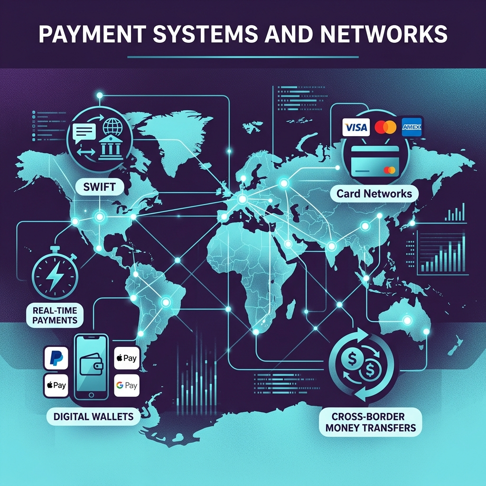
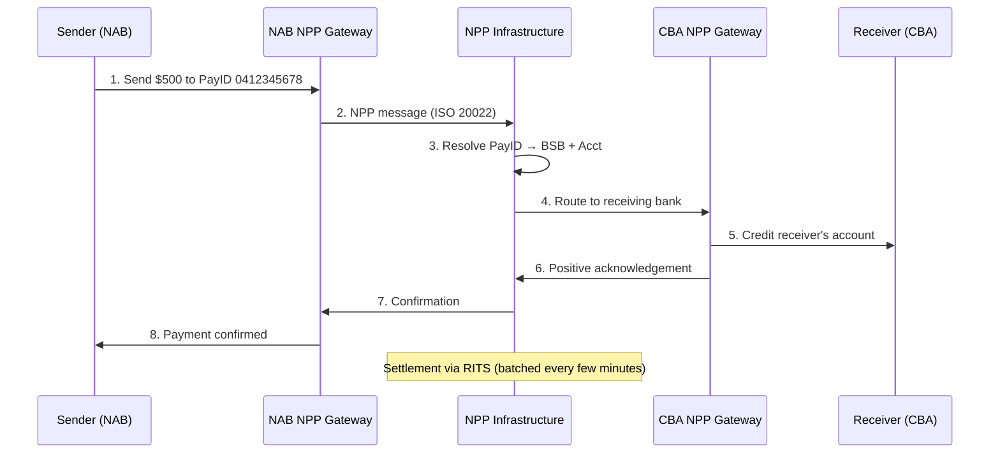
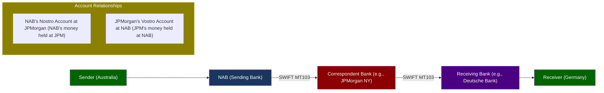
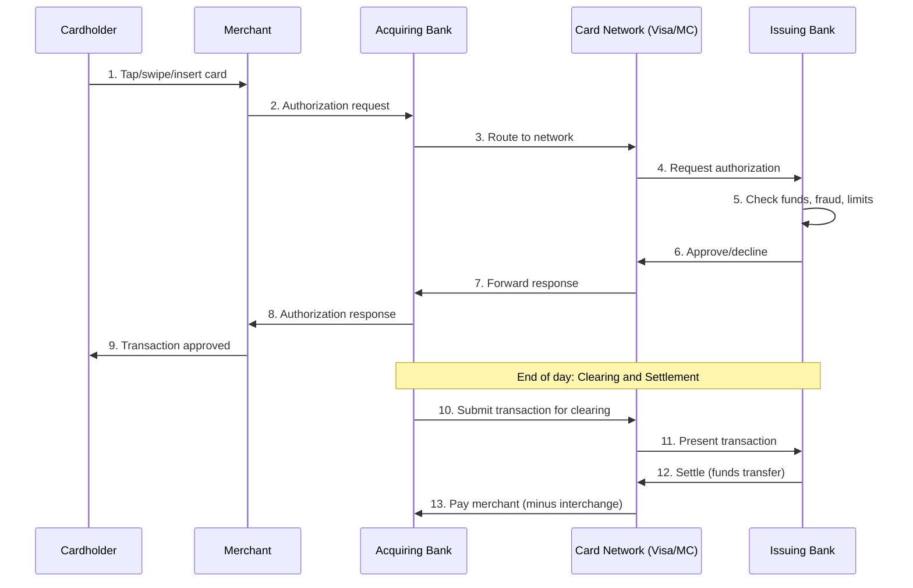
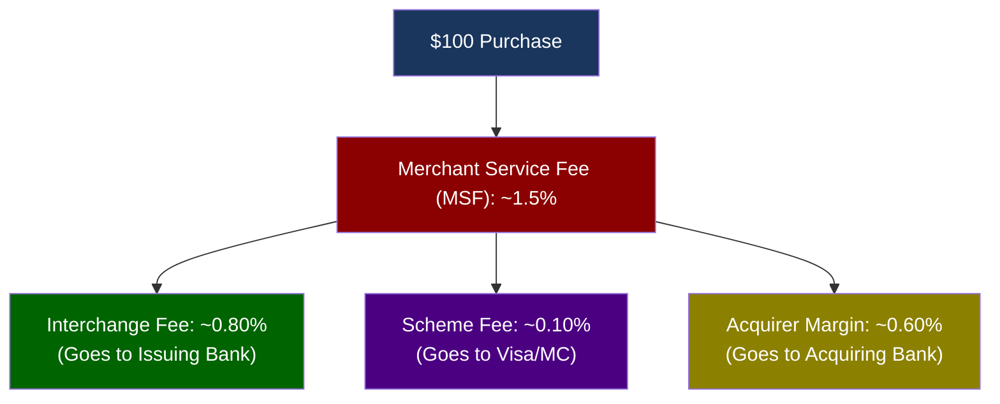
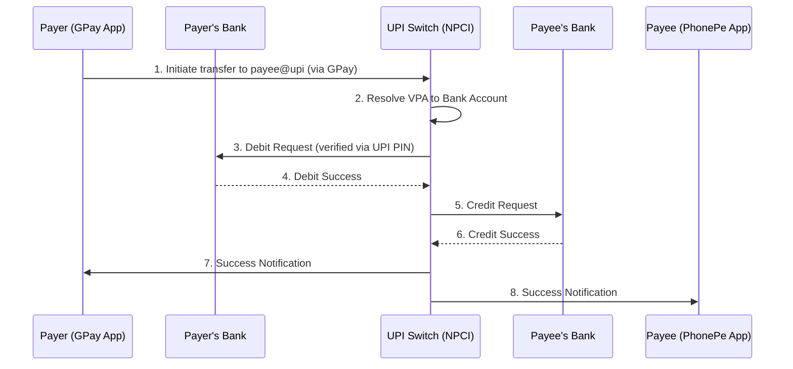
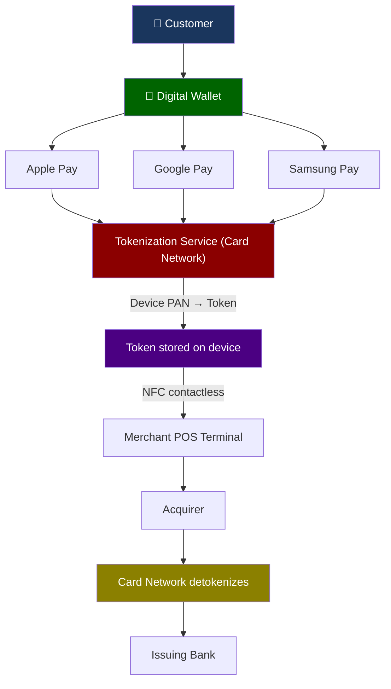

# Module 04: Payment Systems & Networks



> **Learning Objective**: Understand how money actually moves — from domestic transfers to international SWIFT payments, card networks, and Australia's real-time payment infrastructure (NPP).

---

## Table of Contents

- [4.1 Payment Lifecycle](#41-payment-lifecycle)
- [4.2 Australian Domestic Payments](#42-australian-domestic-payments)
- [4.3 International Payments (SWIFT)](#43-international-payments-swift)
- [4.4 Card Payment Networks](#44-card-payment-networks)
- [4.5 ISO 20022 Messaging Standard](#45-iso-20022-messaging-standard)
- [4.6 Global Real-Time Payment Architectures (UPI, PIX)](#46-global-real-time-payment-architectures-upi-pix)
- [4.7 Digital Wallets & Alternative Payments](#47-digital-wallets--alternative-payments)
- [4.8 Key Takeaways](#48-key-takeaways)

---

## 4.1 Payment Lifecycle

Every payment — whether a tap-and-go coffee purchase or a $50M international wire — follows the same fundamental lifecycle.

```mermaid
graph LR
    subgraph INIT["1. Initiation"]
        I1["Payer authorizes payment"]
    end
    
    subgraph VALID["2. Validation"]
        V1["Authenticate payer"]
        V2["Check sufficient funds"]
        V3["Sanctions/fraud screening"]
    end
    
    subgraph CLEAR["3. Clearing"]
        C1["Payment instruction transmitted"]
        C2["Reconciliation between banks"]
        C3["Net positions calculated"]
    end
    
    subgraph SETTLE["4. Settlement"]
        S1["Actual money moves between banks"]
        S2["Central bank settlement accounts"]
        S3["Finality achieved"]
    end
    
    subgraph NOTIFY["5. Notification"]
        N1["Payer confirmation"]
        N2["Payee notification"]
        N3["Statement update"]
    end
    
    INIT --> VALID --> CLEAR --> SETTLE --> NOTIFY
    
    style INIT fill:#006400,color:#fff
    style VALID fill:#0d4f4f,color:#fff
    style CLEAR fill:#1a365d,color:#fff
    style SETTLE fill:#4b0082,color:#fff
    style NOTIFY fill:#8b8000,color:#fff
```



### Payment Classification

| Dimension | Options | Examples |
|-----------|---------|---------|
| **Value** | High-value vs Low-value | RTGS for >$100K / BECS for payroll |
| **Speed** | Real-time vs Batch | NPP (instant) / BECS (next day) |
| **Geography** | Domestic vs Cross-border | BSB transfer / SWIFT wire |
| **Instrument** | Credit transfer vs Direct debit vs Card | Push payment / Pull payment / Card tap |
| **Channel** | Branch, ATM, Online, Mobile, API | Internet banking / Mobile app |

---

## 4.2 Australian Domestic Payments

Australia has a sophisticated payment infrastructure managed by the **RBA** and **Australian Payments Network (AusPayNet)**.

```mermaid
graph TD
    AUS["🇦🇺 Australian Payment Systems"]
    AUS --> NPP["⚡ NPP / PayID"]
    AUS --> BECS["📄 BECS"]
    AUS --> RTGS["🏛️ RITS/RTGS"]
    AUS --> CARDS["💳 Card Systems"]
    AUS --> CHQ["📝 Cheques"]
    
    NPP --> NPP1["Real-time, 24/7"]
    NPP --> NPP2["$1M limit per transaction"]
    NPP --> NPP3["ISO 20022 messages"]
    
    BECS --> BECS1["Batch processing"]
    BECS --> BECS2["Direct Credits/Debits"]
    BECS --> BECS3["T+1 settlement"]
    
    RTGS --> RTGS1["High-value transfers"]
    RTGS --> RTGS2["Real-time, gross settlement"]
    RTGS --> RTGS3["Through RBA RITS system"]
    
    CARDS --> CARDS1["eftpos (domestic)"]
    CARDS --> CARDS2["Visa / Mastercard"]
    CARDS --> CARDS3["American Express"]
    
    style AUS fill:#1a365d,color:#fff,stroke-width:3px
    style NPP fill:#006400,color:#fff
    style BECS fill:#4b0082,color:#fff
    style RTGS fill:#8b0000,color:#fff
    style CARDS fill:#8b8000,color:#fff
    style CHQ fill:#4a4a4a,color:#fff
```



### 4.2.1 New Payments Platform (NPP)

The NPP is Australia's **real-time payment infrastructure**, launched in 2018.

| Feature | Detail |
|---------|--------|
| **Speed** | Near real-time (typically <1 second) |
| **Availability** | 24/7/365 |
| **Settlement** | Through RITS (RBA's settlement system) |
| **Transaction limit** | Up to $1,000,000 |
| **Message format** | ISO 20022 (rich data) |
| **Overlay service** | Osko (basic fast payment) |
| **Addressing** | PayID (phone number, email, ABN, or Org ID) |

**PayID Types**:

| PayID Type | Example | Who Uses It |
|------------|---------|-------------|
| **Phone number** | 0412 345 678 | Individuals |
| **Email address** | john@email.com | Individuals, small business |
| **ABN** | 12 345 678 901 | Businesses |
| **Organisation ID** | NAB001 | Large organisations |



### 4.2.2 BECS (Bulk Electronic Clearing System)

The **workhorse** of Australian payments — handles payroll, direct debits, and recurring payments.

| Feature | Direct Credit (DE) | Direct Debit (DD) |
|---------|-------------------|-------------------|
| **Direction** | Push (payer sends) | Pull (payee collects) |
| **Use case** | Salary, supplier payments | Bill payments, subscriptions |
| **Processing** | Batch (overnight) | Batch (overnight) |
| **Settlement** | T+1 (next business day) | T+1 |
| **Authorization** | Payer's bank validates | DDR agreement required |
| **Reversal** | Difficult after settlement | Customer can dispute within timeframe |

**BECS File Format** (what engineers see):

```
0                 01BBA       NAB       PAYROLL RUN    032078 ...
1083-004 12345678 130000050000JOHN SMITH         SALARY    083-004  98765432NAB COMPANY   00000000
1062-000 87654321 130000075000JANE DOE           SALARY    083-004  98765432NAB COMPANY   00000000
7999-999            000001250000000012500000000000000000000002          000000
```

| Record | Type | Content |
|--------|------|---------|
| `0` | Descriptive | File header — bank, company details, processing date |
| `1` | Detail | Individual payment — BSB, account, amount, name, reference |
| `7` | File Total | Summary — total count, total amount, hash |

### 4.2.3 RITS/RTGS (Reserve Bank Information and Transfer System)

| Feature | Detail |
|---------|--------|
| **Operated by** | Reserve Bank of Australia (RBA) |
| **Purpose** | Settle high-value and time-critical payments |
| **Settlement** | Real-Time Gross Settlement (each payment individually) |
| **Participants** | Banks, clearing houses, government |
| **Typical transactions** | Interbank settlements, property settlements, government payments |
| **Operating hours** | 7:30 AM – 10:00 PM AEST (business days) |

---

## 4.3 International Payments (SWIFT)

### What Is SWIFT?

**SWIFT** (Society for Worldwide Interbank Financial Telecommunication) is a **messaging network** — it doesn't move money, it sends **instructions** between banks.

| Fact | Detail |
|------|--------|
| **Founded** | 1973, headquartered in Belgium |
| **Members** | 11,000+ institutions in 200+ countries |
| **Messages/day** | ~45 million |
| **Function** | Standardized financial messaging |
| **NOT** | A payment system — it's a communication network |

### SWIFT Message Types (MT)

| Message Type | Purpose | Example |
|-------------|---------|---------|
| **MT103** | Single customer credit transfer | Send $50,000 to a supplier overseas |
| **MT202** | Bank-to-bank transfer | Interbank settlement |
| **MT199** | Free-format message | Ad-hoc communication between banks |
| **MT700** | Issue of a documentary credit | Letter of Credit issuance |
| **MT940** | Customer statement | End-of-day account statement |
| **MT950** | Statement message | Nostro/Vostro reconciliation |

> **Migration**: SWIFT is migrating from MT messages to **ISO 20022 (MX messages)** by November 2025. This is a major industry transformation.

### Correspondent Banking

When two banks don't have a direct relationship, they use **correspondent banks** as intermediaries.



### Nostro vs Vostro Accounts

| Term | Meaning | Perspective | Example |
|------|---------|-------------|---------|
| **Nostro** | "Our account with you" | The sending bank's perspective | NAB's USD account at JPMorgan |
| **Vostro** | "Your account with us" | The correspondent's perspective | JPMorgan calls NAB's account a "Vostro" |
| **Loro** | "Their account" | A third-party perspective | When Bank C refers to NAB's account at JPMorgan |

> **Key insight**: The same account is called "Nostro" by one party and "Vostro" by the other. It's a matter of perspective.

### SWIFT Codes (BIC)

A **BIC (Bank Identifier Code)** uniquely identifies a bank on the SWIFT network.

```
N A B S A U 2 S X X X
│ │ │ │ │ │ │ │ │ │ │
│ │ │ │ │ │ │ │ └─┘─── Branch code (optional, XXX = head office)
│ │ │ │ │ │ └─┘────── Location code (2S = Sydney)
│ │ │ │ └─┘────────── Country code (AU = Australia)
└─┘─┘─┘────────────── Bank code (NABS = National Australia Bank)
```

---

## 4.4 Card Payment Networks

### How a Card Transaction Works



### The Four-Party Model

| Party | Role | Example |
|-------|------|---------|
| **Cardholder** | Person making the payment | You, buying coffee |
| **Merchant** | Business accepting the payment | The coffee shop |
| **Acquirer** (Merchant's bank) | Processes card payments for merchant | NAB Merchant Services |
| **Issuer** (Cardholder's bank) | Issued the card to the customer | CBA (who issued your Visa card) |
| **Card Network** | Connects acquirers and issuers | Visa, Mastercard, eftpos |

### Fee Structure



| Fee Component | Who Pays | Who Receives | Rate |
|--------------|----------|-------------|------|
| **Interchange** | Acquirer → Issuer | Issuing bank | 0.2%–1.5% (regulated in AU) |
| **Scheme fee** | Acquirer → Network | Visa/Mastercard | 0.05%–0.15% |
| **MSF** | Merchant → Acquirer | Acquiring bank | 0.8%–3.0% total |

> **Australian Regulation**: The RBA regulates interchange fees. Debit interchange is capped at ~$0.15 per transaction or 0.2% (whichever is lower). Credit interchange averages ~0.5%.

### Card Types & Technologies

| Technology | Speed | Security | Limit (AU) |
|-----------|-------|----------|-----------|
| **Tap (Contactless/NFC)** | <1 second | Tokenized, encrypted | Under $200 no PIN |
| **Chip & PIN (EMV)** | 2-3 seconds | Chip generates unique code | No limit (PIN verified) |
| **Magnetic stripe** | 2-3 seconds | Static data (least secure) | Being phased out |
| **Online (Card Not Present)** | Varies | 3D Secure (OTP verification) | Card limit applies |
| **Mobile wallet** | <1 second | Tokenized (device-specific token) | Depends on wallet settings |

---

## 4.5 ISO 20022 Messaging Standard

### What Is ISO 20022?

ISO 20022 is the **new universal financial messaging standard** replacing older formats. It enables richer, more structured data.

| Aspect | Old (MT/BECS) | New (ISO 20022) |
|--------|--------------|----------------|
| **Data format** | Fixed-length text fields | XML/JSON structured |
| **Data richness** | Limited | Rich (purpose codes, remittance info) |
| **Structured data** | Minimal | Full names, addresses, references |
| **Character set** | Limited ASCII | Unicode (supports CJK, Arabic, etc.) |
| **Interoperability** | Region-specific formats | Global standard |

### Why It Matters for Engineers

```xml
<!-- ISO 20022 pain.001 (Payment Initiation) Example -->
<CstmrCdtTrfInitn>
  <GrpHdr>
    <MsgId>MSG-2026-0327-001</MsgId>
    <CreDtTm>2026-03-27T12:00:00</CreDtTm>
    <NbOfTxs>1</NbOfTxs>
    <CtrlSum>50000.00</CtrlSum>
  </GrpHdr>
  <PmtInf>
    <PmtMtd>TRF</PmtMtd>
    <CdtTrfTxInf>
      <Amt><InstdAmt Ccy="AUD">50000.00</InstdAmt></Amt>
      <CdtrAgt>
        <FinInstnId><BICFI>CTBAAU2S</BICFI></FinInstnId>
      </CdtrAgt>
      <Cdtr><Nm>Acme Corporation Pty Ltd</Nm></Cdtr>
      <CdtrAcct><Id><Othr><Id>062000-12345678</Id></Othr></Id></CdtrAcct>
      <RmtInf><Ustrd>Invoice INV-2026-0542 - March services</Ustrd></RmtInf>
    </CdtTrfTxInf>
  </PmtInf>
</CstmrCdtTrfInitn>
```

### Key ISO 20022 Message Categories

| Category | Code | Purpose | Example |
|----------|------|---------|---------|
| **Payment Initiation** | pain.* | Customer → Bank payment instructions | pain.001 (Credit Transfer) |
| **Payment Clearing** | pacs.* | Bank → Bank payment messages | pacs.008 (Customer Credit Transfer) |
| **Cash Management** | camt.* | Account statements and reporting | camt.053 (Bank-to-Customer Statement) |
| **Securities** | sese.*, semt.* | Securities settlement and statements | sese.023 (Settlement Instruction) |
| **Trade Finance** | tsrv.*, tsmt.* | Trade service management | tsmt.012 (Baseline Report) |

---

## 4.6 Global Real-Time Payment Architectures (UPI, PIX)

While Australia uses the NPP, other nations have developed their own massive real-time payment ecosystems. **UPI (India)** and **PIX (Brazil)** are widely considered the gold standards globally for transaction volume and innovation.

### 4.6.1 UPI (Unified Payments Interface) - India

UPI is an instant real-time payment system developed by the National Payments Corporation of India (NPCI) facilitating inter-bank peer-to-peer (P2P) and person-to-merchant (P2M) transactions.

**How it works structurally:**
1. **Virtual Payment Address (VPA)**: Similar to Australia's PayID but more flexible. Users create IDs like `name@bankname` or `phone@upi`.
2. **Two-Factor Authentication (2FA)**: Uses device binding (the app is tied to the SIM card) and a UPI PIN.
3. **Open Architecture (Interoperability)**: You can link your SBI Bank account to a Google Pay app. The front-end app (PSP - Payment Service Provider) is decoupled from the bank holding the funds.
4. **Push & Pull**: Supports sending money (PUSH) and requesting money (PULL/Collect).



### 4.6.2 Peer-to-Peer (P2P) Mechanisms

P2P transactions can be broadly divided into two structural models:

| Aspect | **Account-to-Account (A2A)** | **Stored Value (Wallet-to-Wallet)** |
|--------|----------------------------|-----------------------------------|
| **Examples** | UPI, Zelle (USA), NPP/Osko, Paym (UK) | PayPal, Venmo, Cash App, Alipay |
| **Where money lives** | In actual bank checking/savings accounts | In the provider's digital ledger (e-money) |
| **Settlement** | Central bank / National switch clearing | Internal database update |
| **Speed** | Instant via national real-time rails | Instant within the app's ecosystem |
| **Cashing out** | Not needed (funds already in bank) | Requires transfer to bank (T+1 or instant fee) |

> **Key Takeaway**: A wallet P2P transfer (like sending Venmo balance) is technically just a database entry update on Venmo's servers. No actual money moves between banks until you "withdraw" to your bank account.

---

## 4.7 Digital Wallets & Alternative Payments

### Digital Wallet Architecture



### How Tokenization Works

| Step | What Happens | Security Benefit |
|------|-------------|-----------------|
| 1. **Enrollment** | Customer adds card to wallet | Card number verified with issuing bank |
| 2. **Token creation** | Card network creates a device-specific token | Real card number never stored on device |
| 3. **Transaction** | Token + cryptogram sent to merchant | Unique per transaction — can't be replayed |
| 4. **Detokenization** | Card network maps token → real PAN | Only the network can reverse the mapping |
| 5. **Authorization** | Issuing bank processes as normal card transaction | Bank sees the real card number |

### Alternative Payment Methods

| Method | How It Works | Key Players |
|--------|-------------|-------------|
| **QR Code payments** | Scan to pay (merchant-presented or customer-presented) | PayPal, WeChat Pay |
| **A2A (Account-to-Account)** | Direct bank transfer via Open Banking | PayTo (AU), PIX (Brazil) |
| **BNPL** | Split into 4 installments, no interest | Afterpay, Zip, Klarna |
| **Crypto payments** | Bitcoin/ETH for goods and services | BitPay, various |
| **PayTo** | New AU standard for real-time direct debit via NPP | Replacing DDR agreements |

### PayTo (Australia's Next-Gen Direct Debit)

| Feature | Traditional Direct Debit | PayTo |
|---------|------------------------|-------|
| **Authorization** | Paper DDR form | Digital mandate via banking app |
| **Visibility** | Customer may forget about DDs | Visible in banking app, easy to manage |
| **Speed** | Batch (T+1) | Real-time via NPP |
| **Dispute resolution** | Slow, manual | Automated, instant |
| **Data** | Limited information | Rich ISO 20022 data |

---

## 4.8 Key Takeaways

> [!IMPORTANT]
> **Core Concepts to Remember**:
> 1. Every payment goes through **initiation → validation → clearing → settlement → notification**
> 2. **NPP** is Australia's real-time payment system; **BECS** is the batch workhorse
> 3. **SWIFT** is a messaging network, NOT a payment system — it sends instructions
> 4. **Nostro/Vostro** are two names for the same account from different perspectives
> 5. Card payments involve **four parties** (cardholder, merchant, acquirer, issuer) + the network
> 6. **ISO 20022** is transforming financial messaging — richer data, global standard
> 7. **PayTo** is replacing traditional direct debits in Australia

### Common Vocabulary from This Module

| Term | Definition |
|------|-----------|
| **NPP** | New Payments Platform — Australia's real-time payment infrastructure |
| **PayID** | An alias (phone, email, ABN) linked to a bank account for NPP payments |
| **BECS** | Bulk Electronic Clearing System — batch payment system for direct credits/debits |
| **RITS** | Reserve Bank Information and Transfer System — RBA's settlement system |
| **SWIFT** | Messaging network connecting 11,000+ banks globally |
| **BIC** | Bank Identifier Code — uniquely identifies a bank on SWIFT (e.g., NABSAU2S) |
| **Nostro** | "Our account at your bank" — bank's foreign currency account at correspondent |
| **Vostro** | "Your account at our bank" — correspondent's perspective of Nostro |
| **Interchange** | Fee paid by acquirer to issuer in card transactions |
| **MSF** | Merchant Service Fee — total fee charged to merchant for accepting cards |
| **ISO 20022** | Universal financial messaging standard (XML-based) |
| **PayTo** | Australia's new real-time mandated payment service via NPP |
| **Tokenization** | Replacing card number with a device-specific token for security |

---

**Previous**: [← Module 03 — Banking Products & Services](./03-banking-products-services.md)  
**Next**: [Module 05 — Risk Management & Compliance →](./05-risk-management-compliance.md)
