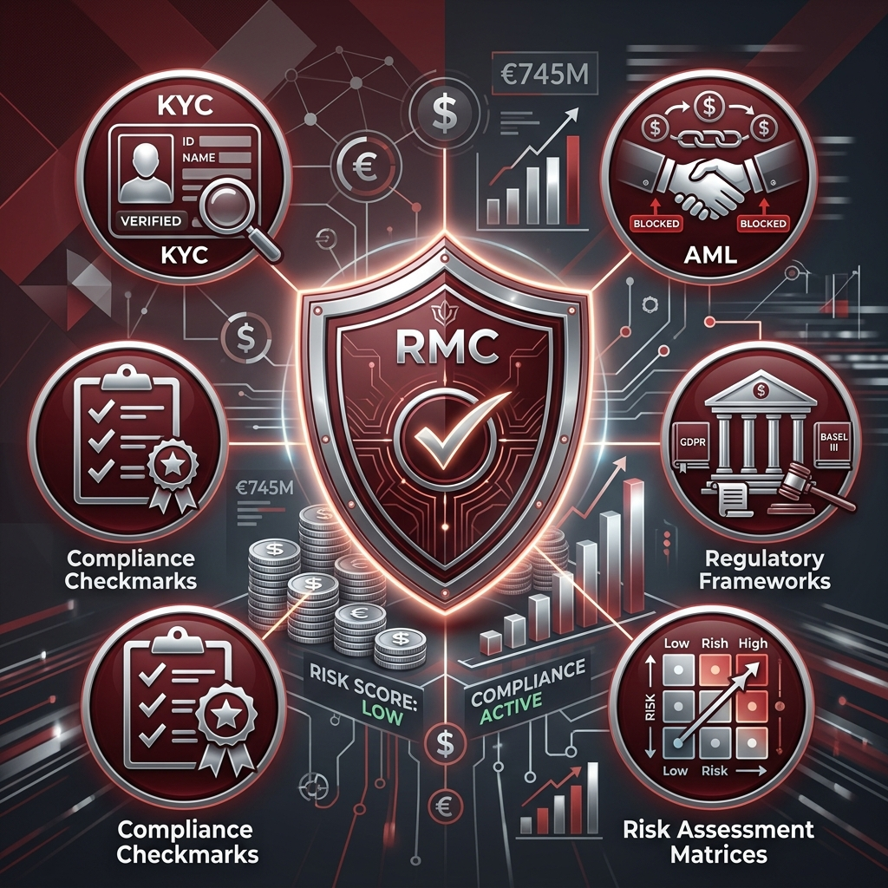
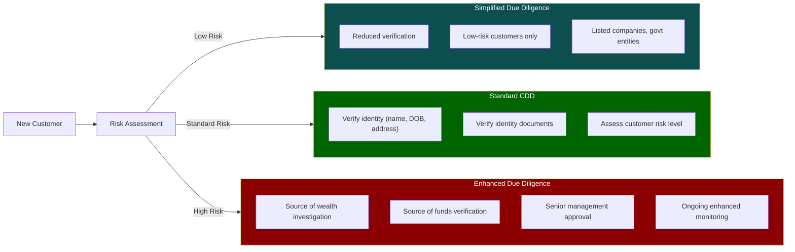
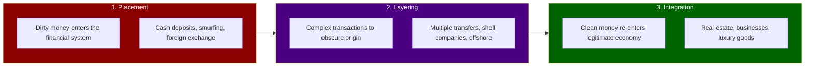
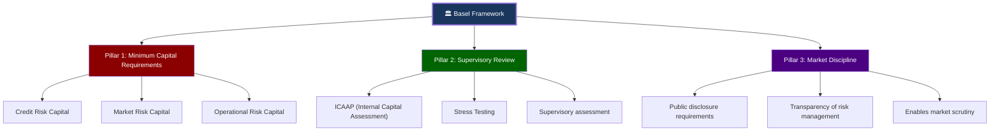
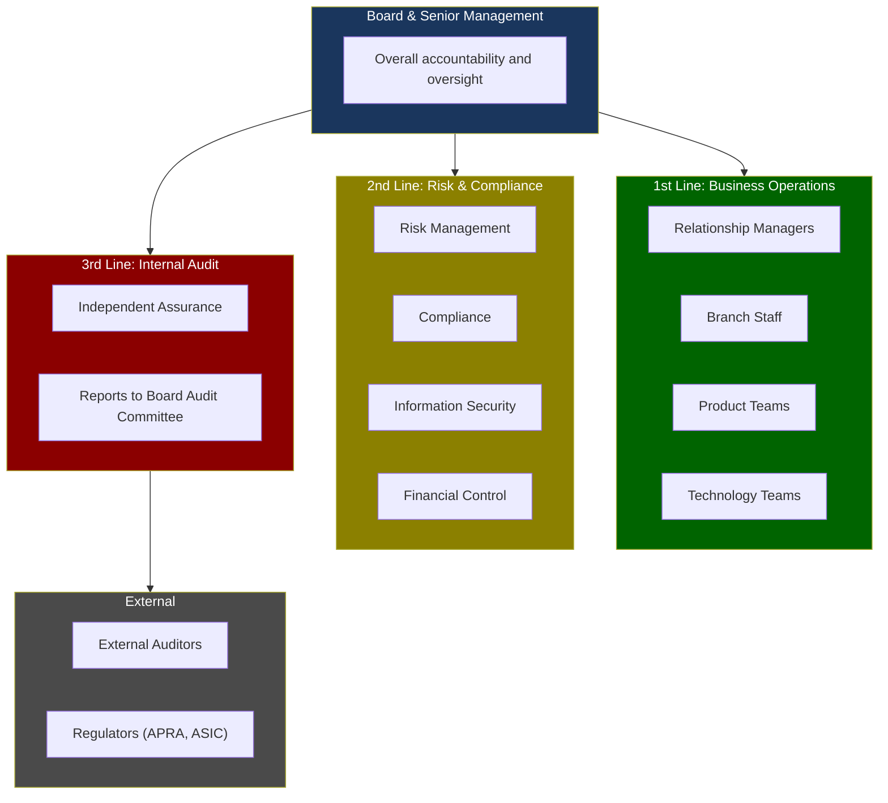
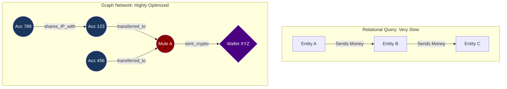

# Module 05: Risk Management & Compliance



> **Learning Objective**: Understand the types of risk banks face, the regulatory frameworks that govern them (KYC, AML, Basel III/IV), and the "Three Lines of Defence" model that structures risk management.

---

## Table of Contents

- [5.1 Types of Risk](#51-types-of-risk)
- [5.2 KYC — Know Your Customer](#52-kyc--know-your-customer)
- [5.3 AML/CTF — Anti-Money Laundering](#53-amlctf--anti-money-laundering)
- [5.4 Basel Framework (III/IV)](#54-basel-framework-iiiiv)
- [5.5 Three Lines of Defence](#55-three-lines-of-defence)
- [5.6 PCI-DSS](#56-pci-dss)
- [5.7 Stress Testing & Scenario Analysis](#57-stress-testing--scenario-analysis)
- [5.8 Financial Crime Technology (FinCrime Tech)](#58-financial-crime-technology-fincrime-tech)
- [5.9 Key Takeaways](#59-key-takeaways)

---

## 5.1 Types of Risk

Banks face **six major categories** of risk:

```mermaid
graph TD
    RISK["🎯 Banking Risks"]
    RISK --> CREDIT["💳 Credit Risk"]
    RISK --> MARKET["📈 Market Risk"]
    RISK --> OPS["⚙️ Operational Risk"]
    RISK --> LIQ["💧 Liquidity Risk"]
    RISK --> CYBER["🔒 Cyber Risk"]
    RISK --> REP["🏷️ Reputational Risk"]
    
    CREDIT --> CR1["Borrower defaults on loan"]
    CREDIT --> CR2["Counterparty fails to pay"]
    
    MARKET --> MR1["Interest rate changes"]
    MARKET --> MR2["Currency fluctuations"]
    MARKET --> MR3["Equity price movements"]
    
    OPS --> OR1["System failures"]
    OPS --> OR2["Human errors"]
    OPS --> OR3["Process breakdowns"]
    OPS --> OR4["External events"]
    
    LIQ --> LR1["Cannot meet obligations"]
    LIQ --> LR2["Bank run scenario"]
    
    CYBER --> CY1["Data breaches"]
    CYBER --> CY2["Ransomware attacks"]
    
    REP --> RP1["Negative public perception"]
    REP --> RP2["Loss of customer trust"]
    
    style RISK fill:#1a365d,color:#fff,stroke-width:3px
    style CREDIT fill:#8b0000,color:#fff
    style MARKET fill:#4b0082,color:#fff
    style OPS fill:#8b8000,color:#fff
    style LIQ fill:#006400,color:#fff
    style CYBER fill:#0d4f4f,color:#fff
    style REP fill:#4a4a4a,color:#fff
```



### Risk Comparison Matrix

| Risk Type | Probability | Impact | Primary Mitigation | Regulatory Focus |
|-----------|------------|--------|-------------------|-----------------|
| **Credit Risk** | High | High | Provisioning, collateral, diversification | Basel capital requirements |
| **Market Risk** | Medium | High | Hedging, limits, VaR models | Market risk capital charge |
| **Operational Risk** | Medium | Variable | Controls, BCP, insurance | OpRisk capital charge |
| **Liquidity Risk** | Low | Critical | Liquid asset buffers, funding diversification | LCR, NSFR ratios |
| **Cyber Risk** | Increasing | Critical | Security controls, monitoring, incident response | CPS 234 (APRA) |
| **Reputational Risk** | Low | Very High | Conduct standards, crisis management | ASIC conduct obligations |

### Credit Risk in Detail

Credit risk is the **#1 risk** for any bank — the risk that a borrower won't repay.

| Concept | Definition | Measurement |
|---------|-----------|-------------|
| **PD** (Probability of Default) | Likelihood the borrower will default | Statistical models, credit scores |
| **LGD** (Loss Given Default) | How much the bank loses if default occurs | Historical recovery rates, collateral value |
| **EAD** (Exposure at Default) | How much the bank is owed when default occurs | Outstanding balance + committed undrawn |
| **Expected Loss** | PD × LGD × EAD | The "normal" loss the bank plans for |
| **Unexpected Loss** | Loss beyond expected — tail risk | Capital buffer required under Basel |

```
Expected Loss = PD × LGD × EAD

Example:
- Loan of $500,000, PD = 2%, LGD = 40%, EAD = $500,000
- Expected Loss = 0.02 × 0.40 × $500,000 = $4,000
- Bank must provision at least $4,000 against this loan
```

---

## 5.2 KYC — Know Your Customer

KYC is the **process of verifying a customer's identity** before and during the banking relationship. It's a legal requirement under AML/CTF laws.



### KYC Components

| Component | What It Involves | Australian Requirements |
|-----------|-----------------|----------------------|
| **CDD** (Customer Due Diligence) | Basic identity verification | 100-point ID check (passport, license, etc.) |
| **EDD** (Enhanced Due Diligence) | Deeper investigation for high-risk customers | Source of wealth, PEP screening, senior sign-off |
| **Ongoing Monitoring** | Continuous review of customer activity | Transaction monitoring, periodic reviews |
| **PEP Screening** | Check if customer is a Politically Exposed Person | Cross-reference against PEP databases |
| **Sanctions Screening** | Check against sanctions lists | DFAT, UN, OFAC sanctions lists |
| **Beneficial Ownership** | Identify who ultimately owns/controls an entity | Must identify anyone with 25%+ ownership |

### The "100-Point Check" (Australia)

Australian banks use a points-based system for identity verification:

| Document | Points | Category |
|----------|--------|----------|
| **Birth certificate** | 70 | Primary |
| **Australian passport** | 70 | Primary |
| **Citizenship certificate** | 70 | Primary |
| **Driver's license** | 40 | Secondary |
| **Medicare card** | 25 | Secondary |
| **Credit card statement** | 25 | Secondary |
| **Utility bill** | 25 | Secondary |

> You need **100 points** minimum. So a passport (70) + driver's license (40) = 110 points ✅

### Customer Risk Rating

| Risk Level | Characteristics | KYC Level | Review Frequency |
|-----------|----------------|-----------|-----------------|
| **Low** | Australian resident, salary earner, standard products | SDD | Every 3–5 years |
| **Medium** | Business customer, moderate complexity | CDD | Every 1–2 years |
| **High** | Foreign PEP, cash-intensive business, complex structures | EDD | Every 6–12 months |
| **Prohibited** | Sanctioned entities, shell companies in high-risk jurisdictions | Account denied | N/A |

---

## 5.3 AML/CTF — Anti-Money Laundering

### What Is Money Laundering?

Money laundering is the process of making illegally-obtained money appear legitimate. It follows three stages:



### Red Flags (Transaction Monitoring)

| Red Flag | Description | Example |
|----------|-------------|---------|
| **Structuring/Smurfing** | Breaking large transactions into smaller ones to avoid reporting | Multiple $9,900 deposits (just under $10K threshold) |
| **Unusual patterns** | Activity inconsistent with customer profile | Retired person suddenly moving $500K+ |
| **Cash-intensive** | Excessive cash transactions | Restaurant depositing 10x expected cash revenue |
| **Rapid movement** | Funds arrive and leave quickly | $100K in, transferred out within hours |
| **Round amounts** | Transfers in exact round figures | $50,000, $100,000, $200,000 |
| **High-risk jurisdictions** | Transfers to/from sanctioned or high-risk countries | Payments to countries on FATF grey list |
| **Shell companies** | Transactions through opaque corporate structures | Payments to BVI-registered entities with no clear business |

### Reporting Requirements (Australia)

| Report | Trigger | Filed With | Timeframe |
|--------|---------|-----------|-----------|
| **TTR** (Threshold Transaction Report) | Cash transaction ≥ $10,000 | AUSTRAC | Within 10 business days |
| **IFTI** (International Fund Transfer Instruction) | Any international transfer | AUSTRAC | Within 10 business days |
| **SMR** (Suspicious Matter Report) | Suspicious activity detected | AUSTRAC | Within 24 hours (if terrorism) or 3 days |
| **AML/CTF Compliance Report** | Annual compliance status | AUSTRAC | Annually |

> **Penalties for non-compliance**: AUSTRAC fined Westpac **$1.3 billion** in 2020 for 23 million breaches of AML/CTF laws — the largest fine in Australian corporate history.

---

## 5.4 Basel Framework (III/IV)

### What Is Basel?

The **Basel Committee on Banking Supervision (BCBS)** sets global standards for bank regulation. Named after Basel, Switzerland, where the committee meets.

| Version | Year | Key Focus |
|---------|------|-----------|
| **Basel I** | 1988 | Minimum capital requirements |
| **Basel II** | 2004 | Risk-weighted capital, three pillars |
| **Basel III** | 2010 | Post-GFC reforms, liquidity requirements |
| **Basel IV** | 2017–2028 | Output floors, standardized approaches |

### The Three Pillars of Basel



### Capital Requirements

Banks must hold **capital buffers** against their risk-weighted assets (RWA):

| Capital Component | Requirement | Purpose |
|-------------------|-------------|---------|
| **CET1** (Common Equity Tier 1) | ≥ 4.5% of RWA | Highest quality capital (shares + retained earnings) |
| **Tier 1 Capital** | ≥ 6.0% of RWA | CET1 + Additional Tier 1 (AT1) instruments |
| **Total Capital** | ≥ 8.0% of RWA | Tier 1 + Tier 2 (subordinated debt) |
| **Capital Conservation Buffer** | +2.5% | Additional CET1 buffer |
| **Countercyclical Buffer** | 0%–2.5% | Variable, set by national regulator |
| **D-SIB Buffer** | +1.0% (AU Big 4) | Extra buffer for systemically important banks |
| **APRA Total (AU Big 4)** | ~16%+ of RWA | Australian requirements exceed Basel minimums |

### Risk-Weighted Assets (RWA)

Not all assets carry the same risk. Banks **weight** their assets by risk level:

| Asset Type | Risk Weight | Example | $100 of Asset = RWA |
|-----------|------------|---------|---------------------|
| **Cash / Government bonds** | 0% | Australian government bonds | $0 RWA |
| **Claims on banks** | 20% | Deposits at other banks | $20 RWA |
| **Residential mortgages** | 35% | Home loan (LVR < 80%) | $35 RWA |
| **Corporate loans** | 100% | Business loan | $100 RWA |
| **Past-due loans (90+ days)** | 150% | Non-performing loans | $150 RWA |

> **Example**: If a bank has $100B in total assets but only $60B in RWA (due to many low-risk assets), and needs 10.5% capital ratio:  
> Required capital = $60B × 10.5% = **$6.3B**

### Key Liquidity Ratios

| Ratio | Formula | Minimum | Purpose |
|-------|---------|---------|---------|
| **LCR** (Liquidity Coverage Ratio) | HQLA / Net Cash Outflows (30 days) | ≥ 100% | Survive 30-day stress scenario |
| **NSFR** (Net Stable Funding Ratio) | Available Stable Funding / Required Stable Funding | ≥ 100% | Long-term funding stability |
| **Leverage Ratio** | Tier 1 Capital / Total Exposure (non-risk-weighted) | ≥ 3% | Backstop to risk-weighted measures |

---

## 5.5 Three Lines of Defence

The **Three Lines of Defence** model is the standard governance framework in banking.



| Line | Who | Role | Accountability |
|------|-----|------|---------------|
| **1st Line** | Business units, IT, operations | Own & manage risks daily | "We take the risk and control it" |
| **2nd Line** | Risk, compliance, InfoSec teams | Set policies, monitor, challenge | "We oversee and advise" |
| **3rd Line** | Internal audit | Independent assurance | "We independently verify" |
| **External** | External auditors, regulators | External oversight | "We hold everyone accountable" |

---

## 5.6 PCI-DSS

**PCI-DSS** (Payment Card Industry Data Security Standard) governs how card data is handled.

### The 12 Requirements

| # | Requirement | Category |
|---|------------|----------|
| 1 | Install and maintain network security controls | Build & Maintain Secure Network |
| 2 | Apply secure configurations to all system components | Build & Maintain Secure Network |
| 3 | Protect stored account data | Protect Account Data |
| 4 | Protect cardholder data with strong cryptography during transmission | Protect Account Data |
| 5 | Protect all systems and networks from malicious software | Maintain Vulnerability Mgmt |
| 6 | Develop and maintain secure systems and software | Maintain Vulnerability Mgmt |
| 7 | Restrict access to system components by business need-to-know | Strong Access Control |
| 8 | Identify users and authenticate access | Strong Access Control |
| 9 | Restrict physical access to cardholder data | Strong Access Control |
| 10 | Log and monitor all access to system components and cardholder data | Monitor & Test Networks |
| 11 | Test security of systems and networks regularly | Monitor & Test Networks |
| 12 | Support information security with organizational policies and programs | Security Policy |

### Compliance Levels

| Level | Criteria | Validation Method |
|-------|----------|------------------|
| **Level 1** | >6 million card transactions/year | Annual on-site audit by QSA |
| **Level 2** | 1–6 million transactions/year | Annual SAQ + quarterly ASV scan |
| **Level 3** | 20,000–1 million e-commerce | Annual SAQ + quarterly ASV scan |
| **Level 4** | <20,000 e-commerce or <1M other | Annual SAQ |

---

## 5.7 Stress Testing & Scenario Analysis

Banks must demonstrate they can survive severe economic shocks.

### APRA Stress Testing Scenarios

| Scenario Type | Description | Example |
|--------------|-------------|---------|
| **Baseline** | Expected economic conditions | GDP +2.5%, unemployment 4% |
| **Adverse** | Moderate downturn | GDP -1%, unemployment 7%, house prices -15% |
| **Severe** | Extreme downturn (GFC-like) | GDP -4%, unemployment 11%, house prices -35% |
| **Reverse** | What would break the bank? | Work backward from failure point |

### What Gets Tested

| Area | Stress Applied | What's Measured |
|------|---------------|----------------|
| **Credit portfolio** | Spike in defaults | Loan losses, provisioning impact |
| **Market risk** | Interest rate shock, FX moves | Trading losses, NIM impact |
| **Liquidity** | Deposit run-off, market freeze | Can the bank meet obligations? |
| **Capital** | Combined stress | Does capital stay above minimums? |
| **Operational** | Major system outage, cyber attack | Business continuity, recovery time |

---

## 5.8 Financial Crime Technology (FinCrime Tech)

For software engineers, Financial Crime is a massive, complex domain intersecting high-throughput distributed systems, graph theory, and machine learning.

The FinCrime technology ecosystem is generally divided into three main pillars:

| Pillar | Focus Area | Technical Nature |
|--------|-----------|------------------|
| **Sanctions & Watchlist Screening** | Checking if we are allowed to do business with an entity or process a payment to them. | String matching (Fuzzy logic, Levenshtein distance), High-throughput, synchronous blocking. |
| **Transaction Monitoring (AML)** | Finding hidden patterns in legitimate-looking transactions (Layering/Integration). | Batch/Asynchronous, Rule engines, Anomaly detection, Graph analysis. |
| **Fraud Detection** | Stopping bad actors from stealing money from the bank or customers (Account Takeover, Scams). | Sub-second real-time inference, device intelligence, behavioral biometrics. |

### 5.8.1 The Tech Challenge of Real-Time Payments

In traditional batch payments (like BECS), banks have hours to run nightly batch jobs for transaction monitoring and sanctions screening. 

In real-time rails like **NPP (Australia) or UPI (India)**, the SLA for the entire payment is often under 1-2 seconds. 
- **The FinCrime Window**: The screening engine might be allocated only **50-100 milliseconds** to decide if a transaction should be blocked.
- **Synchronous vs Asynchronous**: 
  - Sanctions and Fraud are *synchronous* (inline) — the payment is held until the system says "Pass".
  - AML transaction monitoring is typically *asynchronous* (post-event) — the payment goes through, and alerts are generated for analysts to review later.

### 5.8.2 Graph Databases & Network Analysis

Money launderers use complex webs of shell companies and mule accounts to hide the origin of funds (Layering). Traditional relational databases (SQL) are terrible at finding relationships > 2-3 hops deep.

Modern FinCrime tech relies heavily on **Graph Databases** (like Neo4j, TigerGraph, or Amazon Neptune).



Graph DBs allow engineers to run queries like: *"Find all accounts that share a phone number, where at least 3 of those accounts sent money to the same off-shore beneficiary within 48 hours."*

### 5.8.3 The False Positive Problem & Machine Learning

Traditional AML systems are **Rules-Based** (e.g., `IF transaction > $9,900 AND frequency > 3/week THEN Alert`).
- **The Result**: These systems generate massive alert volumes with **95%+ False Positive Rates**.
- **The Cost**: Banks hire thousands of analysts just to click "Close - False Positive".

**The ML Solution:**
Rather than replacing the rules engine (which regulators still like for explainability), banks use ML for **Alert Triage/Scoring**.
1. Rule Engine fires an alert.
2. An ML model evaluates the alert context and scores it (0.0 to 1.0).
3. Alerts below a certain threshold are "auto-hibernated" or deprioritized.
4. Analysts only focus on the top 5% of highest-risk alerts.

### 5.8.4 ISO 20022 and FinCrime

Historically, SWIFT MT messages had unstructured, truncated text strings (e.g., "MR J SMITH BLDG 4 ACME").
- If a terrorist named "JOHN SMITH" was on a sanctions list, the screening engine using fuzzy matching would flag millions of innocent "J SMITHS", bringing operations to a halt.

**ISO 20022** solves this through highly structured XML data:
```xml
<Cdtr>
  <Nm>Johnathan Smith</Nm>
  <PstlAdr>
    <StrtNm>Wall Street</StrtNm>
    <BldgNb>45</BldgNb>
    <TwnNm>New York</TwnNm>
    <Ctry>US</Ctry>
  </PstlAdr>
</Cdtr>
```
With structured fields (`StrtNm`, `Ctry`), screening algorithms can drastically reduce false positives because they know exactly which string is a name and which is a city.

---

## 5.9 Key Takeaways

> [!IMPORTANT]
> **Core Concepts to Remember**:
> 1. Banks face **six major risks**: credit, market, operational, liquidity, cyber, and reputational
> 2. **KYC** is not optional — it's a legal requirement under AML/CTF laws
> 3. **AML** follows three stages: placement → layering → integration
> 4. **Basel III/IV** sets minimum capital, liquidity, and disclosure requirements
> 5. The **Three Lines of Defence** separates risk-taking from risk-oversight from assurance
> 6. **PCI-DSS** governs card data security — 12 mandatory requirements
> 7. **Stress testing** proves a bank can survive economic shocks

### Common Vocabulary from This Module

| Term | Definition |
|------|-----------|
| **KYC** | Know Your Customer — identity verification process |
| **CDD/EDD** | Customer Due Diligence / Enhanced Due Diligence |
| **AML/CTF** | Anti-Money Laundering / Counter-Terrorism Financing |
| **PEP** | Politically Exposed Person — requires enhanced scrutiny |
| **TTR** | Threshold Transaction Report — report for cash ≥$10K |
| **SMR** | Suspicious Matter Report — report for suspicious activity |
| **AUSTRAC** | Australian Transaction Reports and Analysis Centre |
| **CET1** | Common Equity Tier 1 — highest quality bank capital |
| **RWA** | Risk-Weighted Assets — assets adjusted for risk level |
| **LCR** | Liquidity Coverage Ratio — 30-day stress survival measure |
| **PD/LGD/EAD** | Probability of Default / Loss Given Default / Exposure at Default |
| **PCI-DSS** | Payment Card Industry Data Security Standard |
| **Three Lines** | 1st (business), 2nd (risk/compliance), 3rd (internal audit) |
| **ICAAP** | Internal Capital Adequacy Assessment Process |

---

**Previous**: [← Module 04 — Payment Systems & Networks](./04-payment-systems-networks.md)  
**Next**: [Module 06 — Banking Technology & Architecture →](./06-banking-technology-architecture.md)
