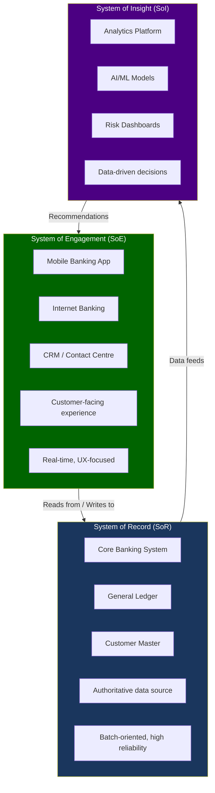
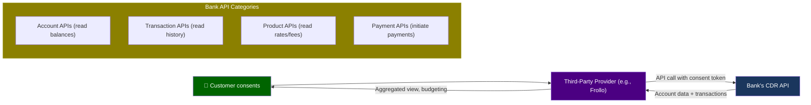
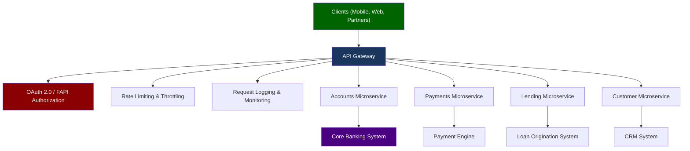
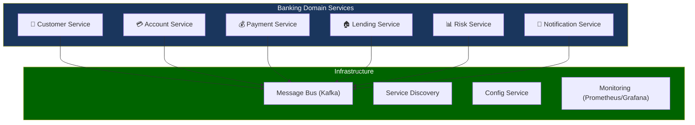
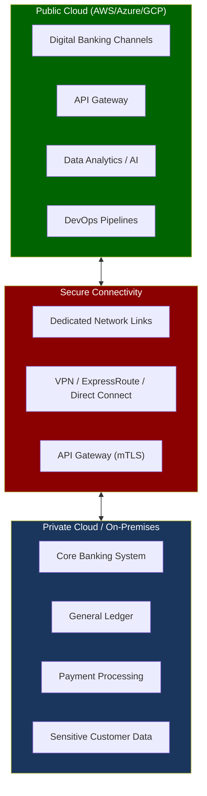
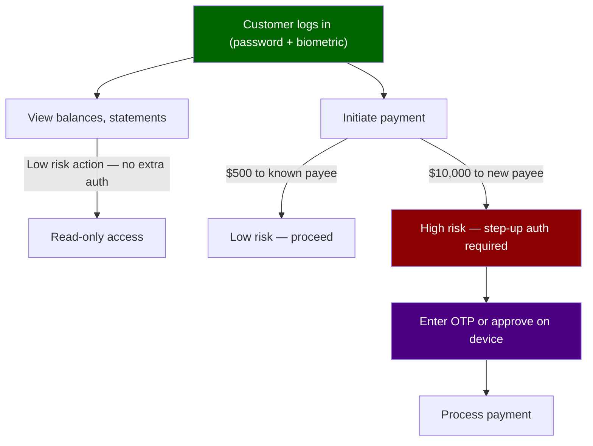

# Module 06: Banking Technology & Architecture


> **Learning Objective**: Understand the technology landscape of modern banking — from core banking systems to APIs, microservices, cloud adoption, and Open Banking — with a focus on what engineers need to know.

---

## Table of Contents

- [6.1 Core Banking Systems](#61-core-banking-systems)
- [6.2 System of Record vs System of Engagement](#62-system-of-record-vs-system-of-engagement)
- [6.3 API-First Banking & BaaS](#63-api-first-banking--baas)
- [6.4 Microservices & Event-Driven Architecture](#64-microservices--event-driven-architecture)
- [6.5 Data Platforms](#65-data-platforms)
- [6.6 Cloud Adoption in Banking](#66-cloud-adoption-in-banking)
- [6.7 Digital Identity & Authentication](#67-digital-identity--authentication)
- [6.8 DevOps & SRE in Banking](#68-devops--sre-in-banking)
- [6.9 Key Takeaways](#69-key-takeaways)

---

## 6.1 Core Banking Systems

The **Core Banking System (CBS)** is the backbone of every bank. It's the system of record for accounts, transactions, and customer data.

### What a Core Banking System Does

```mermaid
graph TD
    CBS["🏛️ Core Banking System"]
    CBS --> ACC["Account Management"]
    CBS --> TXN["Transaction Processing"]
    CBS --> LED["General Ledger"]
    CBS --> INT["Interest Calculation"]
    CBS --> CIF["Customer Information"]
    CBS --> PRD["Product Configuration"]
    
    ACC --> ACC1["Open/close accounts"]
    ACC --> ACC2["Maintain balances"]
    
    TXN --> TXN1["Credits & debits"]
    TXN --> TXN2["Transfers"]
    TXN --> TXN3["Standing orders"]
    
    LED --> LED1["Double-entry posting"]
    LED --> LED2["Sub-ledger management"]
    
    INT --> INT1["Daily accrual"]
    INT --> INT2["Rate management"]
    
    CIF --> CIF1["Customer master data"]
    CIF --> CIF2["KYC information"]
    
    PRD --> PRD1["Product catalog"]
    PRD --> PRD2["Pricing & fees"]
    
    style CBS fill:#1a365d,color:#fff,stroke-width:3px
    style ACC fill:#006400,color:#fff
    style TXN fill:#8b0000,color:#fff
    style LED fill:#4b0082,color:#fff
    style INT fill:#8b8000,color:#fff
    style CIF fill:#0d4f4f,color:#fff
    style PRD fill:#8b4513,color:#fff
```



### Major Core Banking Vendors

| Vendor | Product | Architecture | Used By |
|--------|---------|-------------|---------|
| **Temenos** | Transact (T24) | Java, modular | 3,000+ banks globally |
| **Infosys** | Finacle | Java, SOA | 500+ banks (including some AU) |
| **TCS** | TCS BaNCS | Java, microservices possible | 150+ banks |
| **Thought Machine** | Vault | Cloud-native, microservices | JP Morgan, Lloyds, Standard Chartered |
| **Mambu** | Mambu | Cloud-native, SaaS | Neo-banks, fintechs |
| **10x Banking** | SuperCore | Cloud-native | Westpac (AU — migration in progress) |
| **FIS** | Profile/Modern Banking | Various | Large US/global banks |
| **Oracle** | FLEXCUBE | Java | 900+ financial institutions |
| **SAP** | Banking Services | SAP stack | Some European and Asian banks |

### Core Banking Architecture Patterns


> **NAB Context**: Like most Big 4 banks, NAB runs a complex landscape with legacy mainframe systems at the core, surrounded by modern digital layers. The industry trend is **progressive modernization** — not "big bang" replacements.

---

## 6.2 System of Record vs System of Engagement



| Layer | Purpose | Update Frequency | Examples |
|-------|---------|-----------------|---------|
| **System of Record** | "The truth" — authoritative data store | Batch + real-time | Core CBS, GL, loan systems |
| **System of Engagement** | Customer interaction & experience | Real-time | Mobile app, web portal, chatbot |
| **System of Insight** | Analytics, AI, decision support | Near-real-time to batch | Fraud detection, credit scoring, personalization |
| **System of Integration** | Connects everything together | Real-time | API gateway, ESB, event bus |

---

## 6.3 API-First Banking & BaaS

### Open Banking APIs (CDR in Australia)



### Banking-as-a-Service (BaaS)

| Concept | Description | Example |
|---------|-------------|---------|
| **BaaS** | Bank provides banking infrastructure via APIs to non-banks | A retailer offers branded savings accounts powered by a licensed bank |
| **Embedded Finance** | Financial services built into non-financial platforms | "Pay in 4" at checkout, lending inside accounting software |
| **White-Label** | Bank products offered under another brand | A fintech offers accounts — bank handles compliance & ledger |

### API Architecture



### FAPI (Financial-grade API)

For Open Banking, standard OAuth isn't secure enough. **FAPI** adds:

| Feature | Standard OAuth 2.0 | FAPI (Financial-grade) |
|---------|-------------------|----------------------|
| **Token binding** | Optional | Mandatory |
| **PKCE** | Recommended | Required |
| **mTLS** | Optional | Required for server-to-server |
| **Request objects** | Optional | Signed & encrypted JWTs |
| **ID Token** | Optional claims | Mandatory claims for identity |
| **Consent** | Generic | Granular, purpose-specific |

---

## 6.4 Microservices & Event-Driven Architecture

### Microservices in Banking



### Event-Driven Architecture

| Pattern | Description | Banking Use Case |
|---------|-------------|-----------------|
| **Event Sourcing** | Store events, not just current state | Complete audit trail of every account change |
| **CQRS** | Separate read and write models | High-read balance checks vs low-write transfers |
| **Saga Pattern** | Distributed transaction coordination | Loan origination spanning multiple services |
| **Event Streaming** | Continuous flow of events via Kafka/Pulsar | Real-time fraud detection on transaction stream |

### Example: Payment Processing Events

```
1. PaymentInitiated    → {id: "PAY001", from: "ACC1", to: "ACC2", amount: 500}
2. PaymentValidated    → {id: "PAY001", fraud_check: "passed", balance_check: "passed"}
3. DebitApplied        → {id: "PAY001", account: "ACC1", new_balance: 4500}
4. CreditApplied       → {id: "PAY001", account: "ACC2", new_balance: 3500}
5. PaymentCompleted    → {id: "PAY001", timestamp: "2026-03-27T12:00:00Z"}
6. NotificationSent    → {id: "PAY001", channel: "push", recipient: "ACC1_owner"}
```

---

## 6.5 Data Platforms

### Banking Data Architecture


### Key Data Use Cases in Banking

| Use Case | Data Needed | Output | Business Value |
|----------|-------------|--------|---------------|
| **Credit scoring** | Transaction history, income, bureau data | Risk score (PD) | Better lending decisions |
| **Fraud detection** | Transaction patterns, device data, location | Real-time fraud/no-fraud | Prevent losses |
| **Customer 360** | All customer interactions across channels | Unified customer profile | Personalized service |
| **Regulatory reporting** | GL data, risk positions, customer data | APRA/RBA/ASIC reports | Compliance |
| **Anti-Money Laundering** | Transaction flows, customer networks | Suspicious activity alerts | Legal compliance |
| **Personalization** | Spending patterns, life events | Product recommendations | Cross-sell/up-sell |

---

## 6.6 Cloud Adoption in Banking

### Cloud Adoption Models in Banking

| Model | Description | Banking Suitability | Example Services |
|-------|-------------|-------------------|-----------------|
| **Public Cloud** | Shared infrastructure (AWS, Azure, GCP) | Digital channels, analytics, non-sensitive workloads | AWS EC2, Azure App Service |
| **Private Cloud** | Dedicated infrastructure | Core banking, sensitive data processing | On-prem VMware, OpenStack |
| **Hybrid Cloud** | Mix of public and private | Most common for banks — migrate gradually | Core on-prem + digital on public cloud |
| **Multi-Cloud** | Using multiple public cloud providers | Avoid vendor lock-in, regulatory requirements | AWS for compute + GCP for AI/ML |

### APRA CPS 234 — Cloud Requirements

| Requirement | What It Means for Cloud | Compliance Action |
|------------|------------------------|-------------------|
| **Information security capability** | Cloud security must match on-prem standards | Implement cloud security framework |
| **Policy framework** | Written policies for cloud usage | Cloud governance policy |
| **Information asset classification** | Classify data before moving to cloud | Data classification scheme |
| **Third-party management** | Cloud provider = critical outsourcing | Due diligence, contractual protections |
| **Testing** | Regular testing of cloud security | Penetration testing, DR drills |
| **Incident management** | Report cloud incidents to APRA | Incident response procedures |

### Cloud Architecture for Banking



---

## 6.7 Digital Identity & Authentication

### Authentication Methods in Banking

| Method | Security Level | User Experience | Use Case |
|--------|---------------|----------------|----------|
| **Username + Password** | Low | Simple | Basic web login (being phased out alone) |
| **SMS OTP** | Medium | Moderate friction | Transaction verification |
| **App-based OTP (TOTP)** | Medium–High | Moderate | Online banking MFA |
| **Push notification** | High | Low friction | "Approve this login" on banking app |
| **Biometric (fingerprint/face)** | High | Excellent | Mobile app login |
| **FIDO2/WebAuthn** | Very High | Excellent | Passwordless authentication |
| **Hardware token** | Very High | High friction | Corporate/institutional banking |

### Multi-Factor Authentication (MFA)

| Factor | Type | Banking Examples |
|--------|------|-----------------|
| **Something you know** | Knowledge | Password, PIN, security questions |
| **Something you have** | Possession | Phone (SMS/push), hardware token, card |
| **Something you are** | Inherence | Fingerprint, face ID, voice recognition |

### Step-Up Authentication



---

## 6.8 DevOps & SRE in Banking

### DevOps in Regulated Environments

| Practice | Standard DevOps | Banking DevOps |
|----------|----------------|----------------|
| **CI/CD** | Deploy to prod multiple times/day | Controlled release windows, change approval boards |
| **Infrastructure as Code** | Terraform/Pulumi | Same, but with compliance templates |
| **Monitoring** | Application metrics | Application + regulatory + SLA metrics |
| **Incident management** | PagerDuty, Slack | + Regulatory incident reporting (CPS 234) |
| **Change management** | Automated | CAB (Change Advisory Board) approval |
| **Testing** | Unit, integration, E2E | + Security testing, compliance testing, PEN testing |
| **Environments** | Dev, Staging, Prod | Dev, SIT, UAT, PVT, Pre-Prod, Prod |

### Banking SLAs and Reliability

| System | Availability Target | Max Downtime/Year | Recovery Time |
|--------|--------------------|--------------------|---------------|
| **Internet Banking** | 99.95% | 4.38 hours | <30 minutes |
| **Mobile Banking** | 99.95% | 4.38 hours | <30 minutes |
| **Card Processing** | 99.99% | 52.6 minutes | <5 minutes |
| **Core Banking (daytime)** | 99.99% | 52.6 minutes | <10 minutes |
| **Payment Processing (NPP)** | 99.995% | 26.3 minutes | <5 minutes |

### Environment Strategy


| Environment | Purpose | Data |
|-------------|---------|------|
| **DEV** | Developer coding & unit testing | Synthetic/mock data |
| **SIT** | End-to-end system integration testing | Anonymized production-like data |
| **UAT** | Business users validate requirements | Production-like with test scenarios |
| **PVT** | Performance, load, and volume testing | Scaled production-like data |
| **Pre-Prod** | Final verification before production | Mirror of production |
| **Prod** | Live customer-facing environment | Real customer data |

---

## 6.9 Key Takeaways

> [!IMPORTANT]
> **Core Concepts to Remember**:
> 1. The **Core Banking System** is the system of record — the ultimate source of truth
> 2. Modern banking uses **three systems layers**: Record, Engagement, and Insight
> 3. **Open Banking APIs** (CDR in Australia) enable third-party data access with consent
> 4. **Event-driven architecture** enables real-time processing and complete audit trails
> 5. Banks use **hybrid cloud** — sensitive data on-prem, digital channels on public cloud
> 6. **FAPI** is the financial-grade API security standard (beyond standard OAuth)
> 7. Banking DevOps adds **regulatory compliance** layers to standard practices

### Common Vocabulary from This Module

| Term | Definition |
|------|-----------|
| **CBS** | Core Banking System — the heart of bank operations |
| **SoR** | System of Record — authoritative data source |
| **SoE** | System of Engagement — customer-facing systems |
| **BaaS** | Banking-as-a-Service — bank infrastructure via APIs |
| **CDR** | Consumer Data Right — Australia's Open Banking regulation |
| **FAPI** | Financial-grade API — security standard for banking APIs |
| **CQRS** | Command Query Responsibility Segregation — separate read/write models |
| **CDC** | Change Data Capture — real-time data replication |
| **CPS 234** | APRA's Information Security prudential standard |
| **CAB** | Change Advisory Board — approves production changes |
| **SIT/UAT/PVT** | System Integration / User Acceptance / Performance & Volume Testing |

---

**Previous**: [← Module 05 — Risk Management & Compliance](./05-risk-management-compliance.md)  
**Next**: [Module 07 — Australian Banking & NAB →](./07-australian-banking-nab.md)
