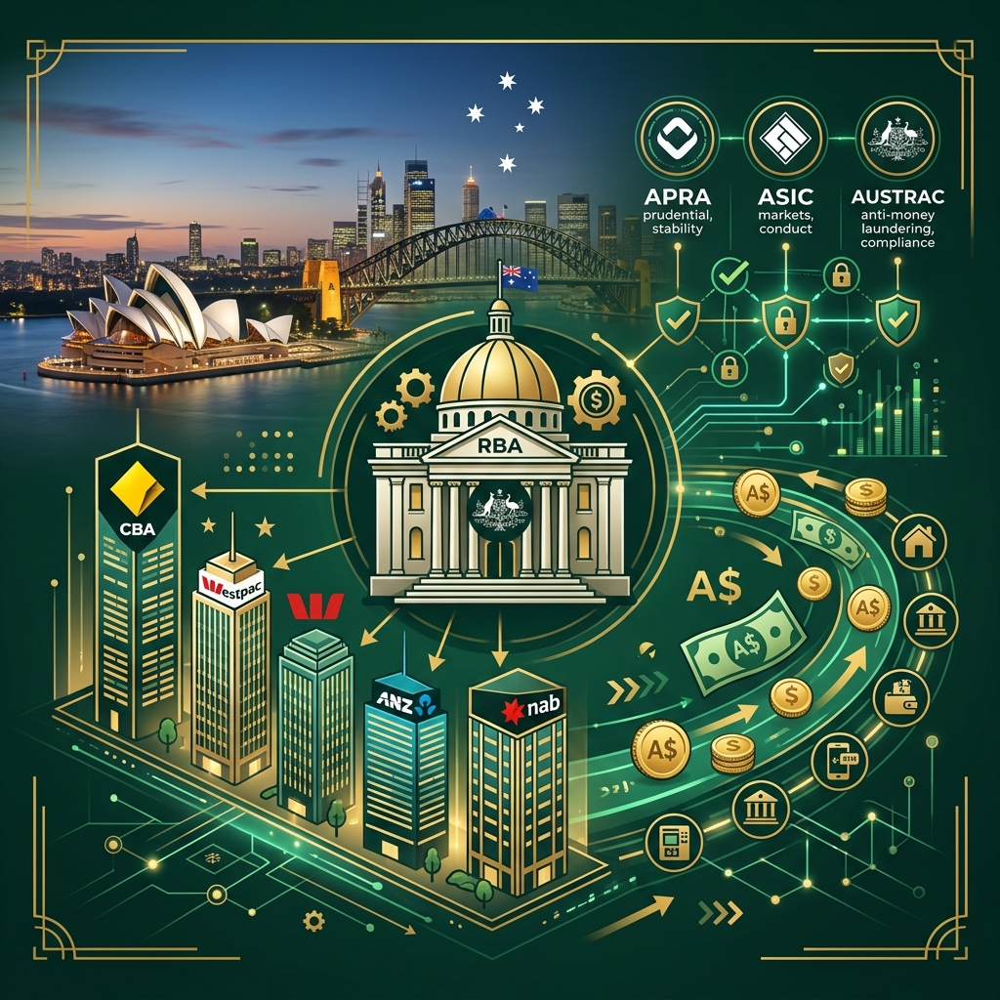
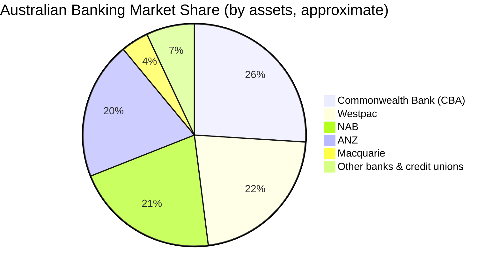
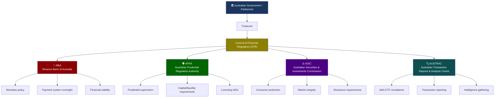
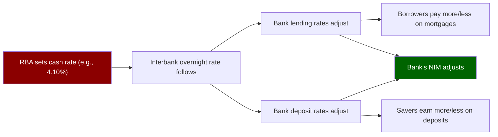
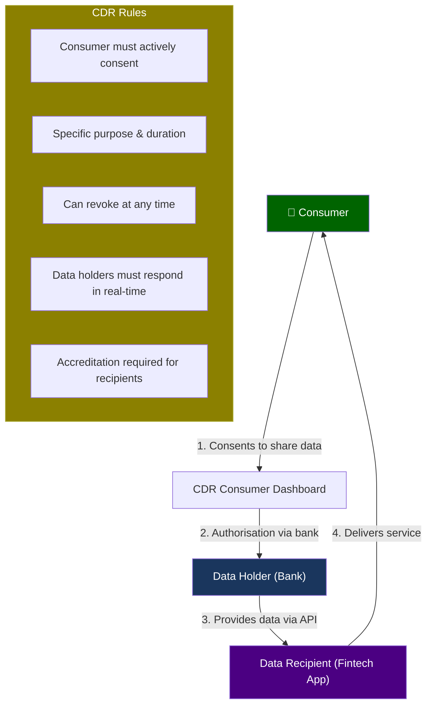
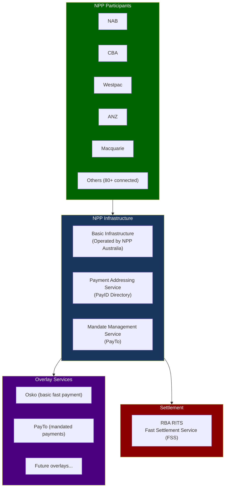
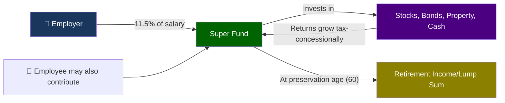
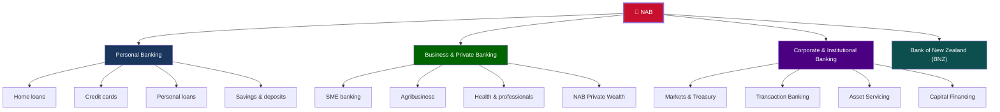

# Module 07: Australian Banking & NAB Context

> **Learning Objective**: Understand the structure of Australia's banking system — the Big 4, key regulators (RBA, APRA, ASIC, AUSTRAC), payment infrastructure, and NAB's position in the market.

---

## Table of Contents

- [7.1 The Australian Banking Landscape](#71-the-australian-banking-landscape)
- [7.2 The "Big 4" Banks](#72-the-big-4-banks)
- [7.3 Regulatory Bodies](#73-regulatory-bodies)
- [7.4 Reserve Bank of Australia (RBA)](#74-reserve-bank-of-australia-rba)
- [7.5 APRA — Prudential Regulation](#75-apra--prudential-regulation)
- [7.6 Consumer Data Right (CDR) / Open Banking](#76-consumer-data-right-cdr--open-banking)
- [7.7 New Payments Platform (NPP) Deep Dive](#77-new-payments-platform-npp-deep-dive)
- [7.8 The Banking Royal Commission](#78-the-banking-royal-commission)
- [7.9 Superannuation System](#79-superannuation-system)
- [7.10 NAB — National Australia Bank](#710-nab--national-australia-bank)
- [7.11 Key Takeaways](#711-key-takeaways)

---

## 7.1 The Australian Banking Landscape

Australia has one of the **most concentrated banking systems** in the developed world. The Big 4 banks dominate with ~75% market share.

### Types of Financial Institutions in Australia

| Type | Count | Examples | Regulator |
|------|-------|---------|-----------|
| **Major banks (Big 4)** | 4 | CBA, Westpac, NAB, ANZ | APRA |
| **Other domestic banks** | ~60 | Macquarie, Bendigo, Bank of Queensland | APRA |
| **Foreign bank branches** | ~45 | HSBC, Citi, ING | APRA |
| **Credit unions / Mutuals** | ~50 | CUA, Heritage, People's Choice | APRA |
| **Non-bank lenders** | Many | Pepper Money, Firstmac, Liberty | ASIC (some APRA) |
| **Neobanks** | ~5 | Up Bank, Judo Bank, Alex Bank | APRA (if licensed) |
| **Fintechs** | Hundreds | Afterpay, Airwallex, Tyro | Various |

---

## 7.2 The "Big 4" Banks

| Attribute | CBA | Westpac | NAB | ANZ |
|-----------|-----|---------|-----|-----|
| **Founded** | 1911 | 1817 | 1858 | 1835 |
| **HQ** | Sydney | Sydney | Melbourne | Melbourne |
| **Total Assets** | ~$1.2T | ~$950B | ~$950B | ~$1.0T |
| **Customers** | ~17M | ~13M | ~9M | ~9M |
| **Employees** | ~49,000 | ~35,000 | ~36,000 | ~38,000 |
| **Branches** | ~800 | ~700 | ~600 | ~500 |
| **Market Cap** | ~$210B | ~$100B | ~$110B | ~$95B |
| **Known For** | Largest by market cap, strongest digital | Oldest bank, legacy challenges | Business banking leader | International presence (NZ, Asia) |

### Competitive Positioning

| Strength | CBA | Westpac | NAB | ANZ |
|----------|-----|---------|-----|-----|
| **Retail banking** | ⭐⭐⭐⭐⭐ | ⭐⭐⭐⭐ | ⭐⭐⭐ | ⭐⭐⭐ |
| **Business banking** | ⭐⭐⭐⭐ | ⭐⭐⭐ | ⭐⭐⭐⭐⭐ | ⭐⭐⭐ |
| **Institutional** | ⭐⭐⭐⭐ | ⭐⭐⭐ | ⭐⭐⭐⭐ | ⭐⭐⭐⭐⭐ |
| **Digital/Innovation** | ⭐⭐⭐⭐⭐ | ⭐⭐⭐ | ⭐⭐⭐⭐ | ⭐⭐⭐⭐ |
| **Wealth management** | ⭐⭐⭐ | ⭐⭐⭐ | ⭐⭐⭐ | ⭐⭐⭐ |

---

## 7.3 Regulatory Bodies

Australia has a "twin peaks" regulatory model — prudential regulation (APRA) is separated from market conduct regulation (ASIC).

### Regulatory Responsibilities

| Regulator | Mandate | Key Powers | Key Legislation |
|-----------|---------|-----------|----------------|
| **RBA** | Monetary policy, financial stability, payment systems | Set cash rate, oversee payment systems | Reserve Bank Act 1959 |
| **APRA** | Safety and soundness of financial institutions | License/supervise/enforce on ADIs, insurers, super funds | Banking Act 1959, Insurance Act 1973 |
| **ASIC** | Market integrity, consumer protection | Enforce Corporations Act, licensing of financial advisors | Corporations Act 2001, ASIC Act 2001 |
| **AUSTRAC** | Anti-money laundering, counter-terrorism financing | Transaction reporting requirements, enforcement | AML/CTF Act 2006 |
| **ACCC** | Competition and consumer protection | Merger approvals, anti-competitive behavior | Competition and Consumer Act 2010 |
| **OAIC** | Privacy and data protection | Enforce Privacy Act, data breach notifications | Privacy Act 1988 |

---

## 7.4 Reserve Bank of Australia (RBA)

### Key Functions

| Function | Description | Impact on Banks |
|----------|-------------|----------------|
| **Monetary Policy** | Sets the official cash rate target | Directly affects bank lending rates and NIM |
| **Financial Stability** | Monitors systemic risk | Regular stability reviews, macro-prudential tools |
| **Payment System Oversight** | Regulates payment systems | Sets interchange fee standards, oversees NPP |
| **Banking Services** | Banker to the government, banks | Operates RITS settlement system |
| **Currency** | Issues Australian banknotes | Banks distribute physical currency |

### How the Cash Rate Affects Banks

> **Key dynamic**: When the RBA raises rates, banks typically pass on the full increase to borrowers but may not fully pass it on to depositors — this can **widen the NIM** temporarily.

---

## 7.5 APRA — Prudential Regulation

### Key Prudential Standards (CPS/APS)

| Standard | Title | What It Covers |
|----------|-------|---------------|
| **APS 110** | Capital Adequacy | Minimum capital requirements |
| **APS 210** | Liquidity | LCR, NSFR requirements |
| **APS 220** | Credit Risk Management | How banks manage credit risk |
| **APS 330** | Public Disclosure | What banks must publish publicly |
| **CPS 220** | Risk Management | Enterprise risk management framework |
| **CPS 230** | Operational Risk Management | Operational resilience requirements (NEW - effective July 2025) |
| **CPS 234** | Information Security | Cybersecurity requirements |
| **CPS 511** | Remuneration | Executive pay tied to risk outcomes |

### APRA Licensing

| Entity Type | APRA License | Requirements |
|------------|-------------|-------------|
| **ADI** (Authorised Deposit-taking Institution) | Required to accept deposits | Capital, governance, risk management, IT |
| **Restricted ADI** | Limited license for new entrants | Pathway to full license within 2 years |
| **General Insurer** | Required to underwrite insurance | Solvency capital, risk management |
| **Life Insurer** | Required for life insurance products | Actuarial, solvency requirements |
| **RSE Licensee** | Required to operate super fund | Trustee obligations, member protection |

> **ADI** (Authorised Deposit-taking Institution) is the key term — if you hear "ADI," think "licensed bank."

---

## 7.6 Consumer Data Right (CDR) / Open Banking

### What Is CDR?

The **Consumer Data Right** is Australia's open data framework. It started with banking and is expanding to energy and telecommunications.

### CDR Data Scope

| Data Category | What's Shared | API Endpoint |
|---------------|---------------|-------------|
| **Product data** | Rates, fees, terms for all products | Public — no consent needed |
| **Account data** | Account names, types, balances | Consumer consent required |
| **Transaction data** | Transaction history (up to 7 years) | Consumer consent required |
| **Direct debits** | Active direct debit arrangements | Consumer consent required |
| **Scheduled payments** | Upcoming scheduled payments | Consumer consent required |
| **Payees** | Saved payee details | Consumer consent required |

### CDR Participants

| Role | Who | Obligation |
|------|-----|-----------|
| **Data Holder** | Banks (Big 4 mandatory, others joining) | Must provide data via APIs when consumer consents |
| **Accredited Data Recipient (ADR)** | Fintechs, comparison sites | Must be accredited by ACCC to receive data |
| **CDR Representative** | Alternative to full accreditation | Operates under an ADR's accreditation via contract |
| **Consumer** | Bank customer | Consents (or revokes) data sharing via their bank |

---

## 7.7 New Payments Platform (NPP) Deep Dive

### NPP Architecture

### NPP vs BECS vs RTGS

| Feature | NPP | BECS | RTGS |
|---------|-----|------|------|
| **Speed** | <1 second | Next business day | Real-time |
| **Availability** | 24/7/365 | Business days only | Business hours |
| **Value limit** | Up to $1M | No specific limit | Any amount |
| **Message format** | ISO 20022 | DE/DD flat file | SWIFT/ISO |
| **Settlement** | Near-real-time (FSS) | DNS (batched) | RTGS (individual) |
| **Use case** | Consumer payments, PayID | Payroll, direct debits | High-value, interbank |
| **Data richness** | Very rich (ISO 20022) | Limited | Standard |

---

## 7.8 The Banking Royal Commission

The **Royal Commission into Misconduct in the Banking, Superannuation and Financial Services Industry** (2017–2019) was a watershed moment for Australian banking.

### Key Issues Identified

| Area | Misconduct Found | Impact |
|------|-----------------|--------|
| **Fees for no service** | Charging financial planning fees to dead people | Billions in remediation |
| **Irresponsible lending** | Lending without proper assessment of capacity | Tighter lending standards |
| **Insurance misconduct** | Selling inappropriate insurance products | Removal of hawking provisions |
| **Conflicts of interest** | Prioritizing sales over customer outcomes | Banning conflicted remuneration |
| **Culture failures** | Revenue targets driving poor conduct | Cultural transformation programs |

### Key Outcomes & Reforms

| Reform | Description | Legislation |
|--------|-------------|-------------|
| **BEAR → FAR** | Individual accountability for senior executives | Financial Accountability Regime Act 2023 |
| **Design & Distribution (DDO)** | Products must be designed for target market | Treasury Laws Amendment 2019 |
| **Best interests duty** | Financial advisors must act in client's best interest | Strengthened under Corporations Act |
| **Breach reporting** | Must report significant breaches to ASIC | Corporations Act amendments |
| **Reference checking** | Industry-wide register for financial advisors | Financial Adviser Standards and Ethics Authority |
| **Unfair contract terms** | Extended to insurance contracts | Insurance Contracts Act amendments |

### Financial Accountability Regime (FAR)

FAR replaced BEAR and holds **individual executives accountable**:

| Aspect | Requirement |
|--------|-------------|
| **Registration** | Accountable persons must be registered with APRA |
| **Accountability statements** | Clear documentation of each person's responsibilities |
| **Accountability maps** | Organizational map showing who is responsible for what |
| **Deferred remuneration** | Part of executive pay must be deferred and can be clawed back |
| **Consequences** | Penalties for failing to meet accountability obligations |

---

## 7.9 Superannuation System

### How Super Works

### Australian Super System by Numbers

| Metric | Value |
|--------|-------|
| **Total assets** | >$4 trillion |
| **Number of accounts** | ~27 million |
| **SG rate (2025-26)** | 12% |
| **Average balance (age 60-64)** | ~$350,000 |
| **Number of funds** | ~125 APRA-regulated + 600,000 SMSFs |
| **Largest fund** | AustralianSuper (~$340B) |

---

## 7.10 NAB — National Australia Bank

### NAB at a Glance

| Attribute | Detail |
|-----------|--------|
| **Founded** | 1858 (as National Bank of Australasia) |
| **Headquarters** | 700 Bourke Street, Docklands, Melbourne |
| **CEO** | Andrew Irvine (from 2024) |
| **Employees** | ~36,000 |
| **Total Assets** | ~$950 billion |
| **Market Cap** | ~$110 billion |
| **Credit Rating** | AA- (S&P), Aa3 (Moody's) |
| **SWIFT Code** | NABSAU3M (Melbourne HQ) |

### NAB's Business Divisions

### NAB's Strategic Focus Areas

| Area | Initiatives |
|------|-----------|
| **Digital Transformation** | Cloud migration, API-first architecture, mobile-first experiences |
| **Business Banking Leadership** | Australia's #1 business bank by market share |
| **Agribusiness** | Largest agribusiness lender in Australia |
| **Innovation** | NAB Ventures (fintech investment), innovation labs |
| **Simplification** | Exited wealth management (sold MLC), focusing on core banking |
| **Sustainability** | $70B+ in environmental financing by 2025 |

### NAB Technology Landscape (Public Knowledge)

| Area | Known Technologies/Initiatives |
|------|-------------------------------|
| **Cloud** | Major AWS partnership, hybrid cloud strategy |
| **Digital Banking** | Mobile app, internet banking, NAB Business app |
| **Payments** | NPP participant, PayID, PayTo early adopter |
| **Data** | Cloud-based data platform, AI/ML for risk and customer insights |
| **API** | CDR compliant, Open Banking APIs |
| **Cybersecurity** | CPS 234 compliant, significant investment in cyber defence |

---

## 7.11 Key Takeaways

> [!IMPORTANT]
> **Core Concepts to Remember**:
> 1. Australia's banking system is **dominated by the Big 4**, with ~75% market share
> 2. Australia uses a **"twin peaks" regulatory model**: APRA (prudential) + ASIC (conduct)
> 3. The **RBA** sets monetary policy via the cash rate, directly affecting bank profitability
> 4. **CDR/Open Banking** gives consumers the right to share their banking data
> 5. The **Banking Royal Commission** fundamentally changed the industry's culture and regulation
> 6. **FAR** holds individual executives accountable for banking failures
> 7. **NAB** is positioned as Australia's #1 business bank with a strong digital transformation agenda

### Common Vocabulary from This Module

| Term | Definition |
|------|-----------|
| **Big 4** | CBA, Westpac, NAB, ANZ — Australia's four largest banks |
| **ADI** | Authorised Deposit-taking Institution — APRA-licensed bank |
| **RBA** | Reserve Bank of Australia — central bank |
| **APRA** | Australian Prudential Regulation Authority |
| **ASIC** | Australian Securities and Investments Commission |
| **AUSTRAC** | Australian Transaction Reports and Analysis Centre |
| **CDR** | Consumer Data Right — Australia's Open Banking framework |
| **NPP** | New Payments Platform — real-time payment infrastructure |
| **PayID** | Alias-based addressing for NPP payments |
| **PayTo** | NPP overlay service for mandated/recurring payments |
| **FAR** | Financial Accountability Regime — individual executive accountability |
| **CPS 234** | APRA's Information Security prudential standard |
| **SG** | Superannuation Guarantee — compulsory employer contribution |
| **D-SIB** | Domestic Systemically Important Bank — Big 4 designation |

---

**Previous**: [← Module 06 — Banking Technology & Architecture](./06-banking-technology-architecture.md)  
**Next**: [Module 08 — Banking Glossary →](./08-banking-glossary.md)
