# Module 09: Global Payment Systems Deep Dive

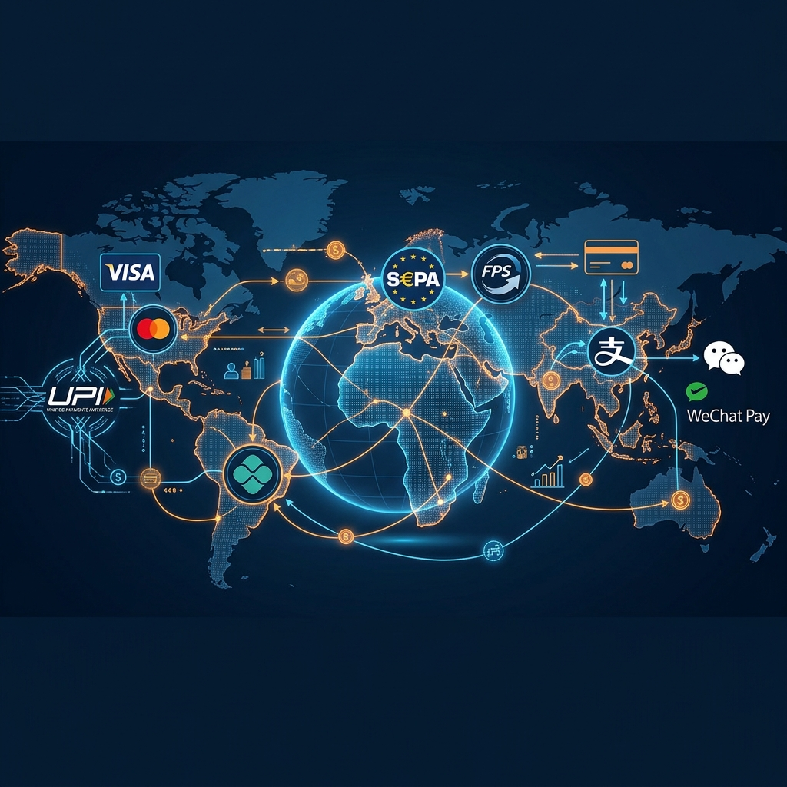

> **Learning Objective**: Understand how the world's most important payment systems work under the hood — from Visa/Mastercard's card networks to India's UPI, Europe's SEPA, Brazil's PIX, UK's Faster Payments, and China's super-app ecosystems. Learn their architecture, economics, and engineering patterns.

---

## Table of Contents

- [9.1 The Global Payment Landscape](#91-the-global-payment-landscape)
- [9.2 Visa — How It Actually Works](#92-visa--how-it-actually-works)
- [9.3 Mastercard — Architecture & Differences](#93-mastercard--architecture--differences)
- [9.4 UPI — India's Unified Payments Interface](#94-upi--indias-unified-payments-interface)
- [9.5 SEPA — Europe's Single Payment Area](#95-sepa--europes-single-payment-area)
- [9.6 PIX — Brazil's Instant Payment System](#96-pix--brazils-instant-payment-system)
- [9.7 Faster Payments (UK)](#97-faster-payments-uk)
- [9.8 China — Alipay & WeChat Pay](#98-china--alipay--wechat-pay)
- [9.9 Comparison: Global Real-Time Payment Systems](#99-comparison-global-real-time-payment-systems)
- [9.10 Cross-Border Payment Evolution](#910-cross-border-payment-evolution)
- [9.11 Key Takeaways](#911-key-takeaways)

---

## 9.1 The Global Payment Landscape

The world's payment systems can be broadly divided into **two categories**:

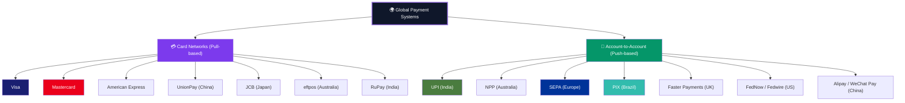

### Card Networks vs Account-to-Account: The Key Difference

| Aspect | Card Networks (Visa/MC) | Account-to-Account (UPI/PIX) |
|--------|------------------------|------------------------------|
| **Model** | Pull-based — merchant "pulls" money from cardholder | Push-based — payer "pushes" money to payee |
| **Intermediaries** | 4+ parties (issuer, acquirer, network, processor) | 2–3 parties (payer's bank, payee's bank, central switch) |
| **Settlement** | T+1 to T+3 (delayed) | Real-time or near real-time |
| **Cost to merchant** | 1.5%–3.0% (interchange + scheme + acquirer fees) | 0%–0.3% (often subsidized or very low) |
| **Revenue model** | Transaction fees (percentage-based) | Volume-based (flat fee or government-subsidized) |
| **Infrastructure age** | 1960s–1970s design, modernized over decades | 2010s–2020s, born cloud-native |
| **Global reach** | 200+ countries | Mostly domestic (cross-border is emerging) |

### Payment Volume by System (Annual Transactions)

| System | Annual Transactions | Annual Value | Country/Region |
|--------|-------------------|-------------|----------------|
| **Visa** | ~260 billion | ~$15 trillion | Global (200+ countries) |
| **Mastercard** | ~140 billion | ~$9 trillion | Global (210+ countries) |
| **UPI** | ~130 billion (2024) | ~$2.2 trillion | India |
| **Alipay + WeChat** | ~100 billion+ | ~$30 trillion+ | China |
| **PIX** | ~40 billion (2024) | ~$2 trillion | Brazil |
| **SEPA** | ~50 billion | ~€50 trillion | Europe (36 countries) |
| **UnionPay** | ~200 billion | ~$20 trillion | China + global |
| **NPP** | ~1.5 billion | ~$1.2 trillion | Australia |

---

## 9.2 Visa — How It Actually Works

### Visa at a Glance

| Fact | Detail |
|------|--------|
| **Founded** | 1958 (as BankAmericard), renamed Visa 1976 |
| **Headquartered** | San Francisco, USA |
| **Network type** | Four-party, open-loop card network |
| **Cards in circulation** | ~4.3 billion |
| **Countries** | 200+ |
| **Revenue (2024)** | ~$35 billion |
| **Employees** | ~30,000 |
| **Key fact** | Visa does NOT lend money or issue cards — it **only operates the network** |

> [!IMPORTANT]
> **Visa is not a bank.** Visa never holds your money, never extends credit, and never issues cards. It is a **technology company** that operates a payment network. The banks that USE the Visa network are called "issuers" and "acquirers."

### Visa's Technical Architecture: VisaNet

**VisaNet** is Visa's global processing network. It's one of the most reliable systems on Earth.

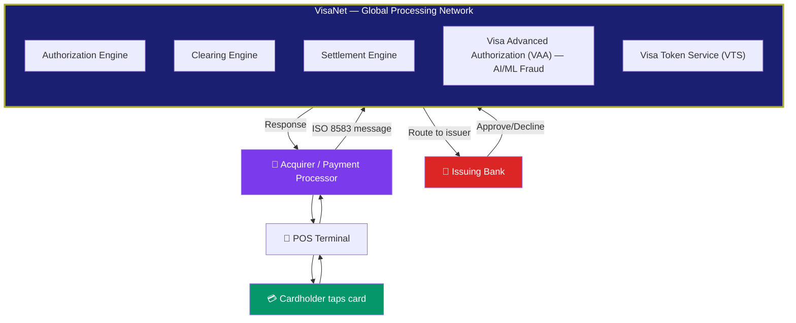

### The Visa Transaction Lifecycle (3 Phases)

#### Phase 1: Authorization (~1-2 seconds)

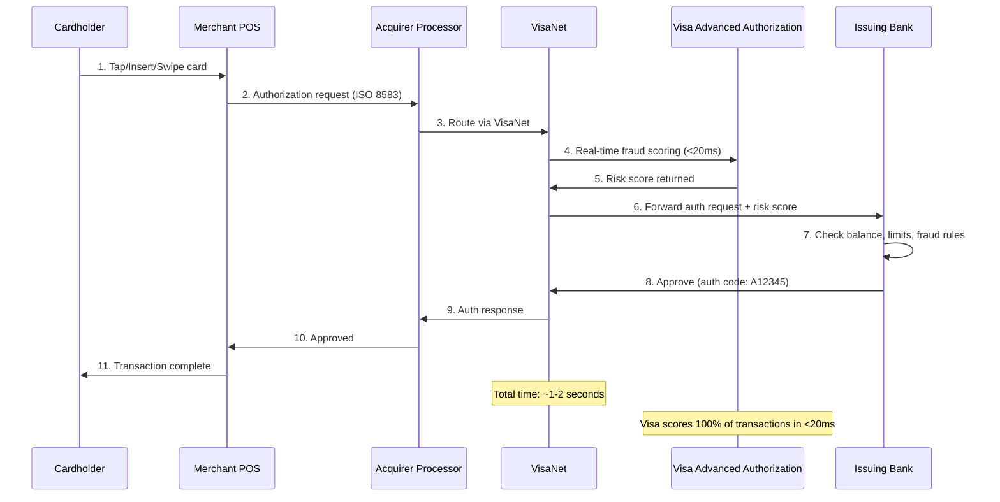

**What the ISO 8583 authorization message contains**:

| Field | Content | Example |
|-------|---------|---------|
| **PAN** | Card number (or token) | 4012 8888 8888 1881 |
| **Amount** | Transaction amount | $42.50 |
| **Currency** | ISO currency code | 036 (AUD) |
| **Merchant Category Code (MCC)** | Type of business | 5812 (Eating places, restaurants) |
| **Terminal ID** | Unique POS terminal | TERM00123456 |
| **Card verification** | CVV/CVC/Chip cryptogram | Dynamic per transaction |
| **Entry mode** | How card was read | 071 (NFC contactless chip) |

#### Phase 2: Clearing (End of Day)

After the transaction day, merchants submit their completed transactions for clearing.

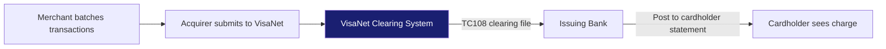

| Step | What Happens | When |
|------|-------------|------|
| Merchant batches | All day's transactions compiled | End of business day |
| Acquirer submits | Clearing file sent to VisaNet | Nightly |
| VisaNet processes | Nets positions between banks | Overnight |
| Issuing bank posts | Charge appears on cardholder's account | Next day |

#### Phase 3: Settlement (T+1 to T+2)

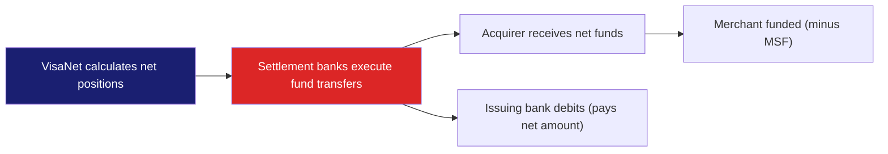

**Visa Settlement**: Visa uses correspondent settlement banks (e.g., JPMorgan) in each currency to move actual money between issuers and acquirers via net settlement. Visa itself never holds funds.

### Visa's Revenue Breakdown

| Revenue Stream | Description | Typical Rate |
|---------------|-------------|-------------|
| **Service revenues** | Based on payment volume flowing through VisaNet | ~0.11% of volume |
| **Data processing revenues** | Per-transaction fee for authorization, clearing, settlement | ~$0.04–$0.08 per transaction |
| **International transaction revenues** | Cross-border currency conversion fees | ~1.0% of cross-border volume |
| **Other revenues** | License fees, consulting, Visa Direct, etc. | Various |

> **Key insight for engineers**: Visa's actual per-transaction fee is tiny (~4-8 cents). The bigger cost merchants feel is the **interchange fee**, which goes to the **issuing bank**, not Visa. Visa sets the interchange rate schedule, but the money flows bank-to-bank.

### Visa Advanced Authorization (VAA) — AI/ML Fraud Detection

| Metric | Detail |
|--------|--------|
| **Coverage** | 100% of VisaNet transactions scored |
| **Latency** | <20 milliseconds per scoring decision |
| **Model** | Deep learning on 500+ risk attributes per transaction |
| **Data points** | Analyzes $400B+ in transaction data |
| **Prevention** | Prevents ~$32 billion in fraud annually |
| **False positive rate** | Continuously optimized — goal is minimize customer friction |

**Risk attributes scored in real-time include**:
- Transaction amount relative to cardholder's normal spending
- Merchant category and location vs cardholder's history
- Time of day / day of week patterns
- Device/terminal characteristics
- Velocity (how many transactions in last X minutes)
- Geographic distance from last transaction
- Cross-border indicators

### Visa Product Suite

| Product | Type | Description |
|---------|------|-------------|
| **Visa Debit** | Debit card | Linked to bank account, real-time balance check |
| **Visa Credit** | Credit card | Revolving credit line |
| **Visa Prepaid** | Prepaid card | Pre-loaded funds (gift cards, travel money) |
| **Visa Direct** | Push payment | Real-time money transfer to any Visa card (P2P, disbursements) |
| **Visa B2B Connect** | Corporate | Cross-border B2B payments via blockchain-inspired network |
| **Visa Token Service** | Security | Tokenization for digital wallets (Apple Pay, Google Pay) |
| **CyberSource** | Gateway | Visa-owned payment gateway for e-commerce |
| **Visa Secure (3DS)** | Authentication | 3D Secure 2.0 for online card-not-present authentication |

### Visa Secure (3D Secure 2.0)

For online (card-not-present) transactions, the merchant can request **additional authentication** via 3D Secure:

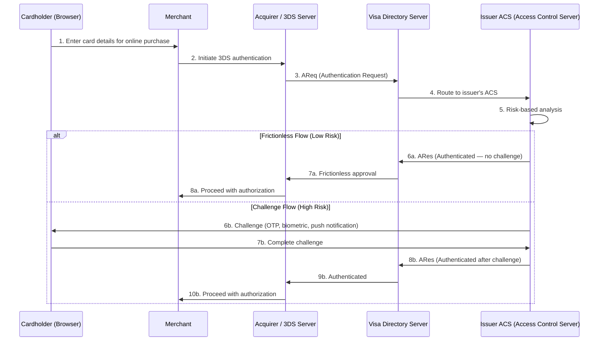

**3DS 2.0 improvements over 1.0**:

| Aspect | 3DS 1.0 (Old) | 3DS 2.0 (Current) |
|--------|---------------|-------------------|
| **UX** | Redirect to bank's page, clunky | Inline, frictionless when possible |
| **Data** | 15 data elements | 150+ data elements for risk analysis |
| **Mobile** | Not mobile-optimized | Native mobile SDK |
| **Biometrics** | Not supported | Fingerprint, face recognition |
| **Result** | 20%–30% cart abandonment | 70%+ frictionless approval |

---

## 9.3 Mastercard — Architecture & Differences

### Mastercard at a Glance

| Fact | Detail |
|------|--------|
| **Founded** | 1966 (as Interbank Card Association), renamed 1979 |
| **Headquartered** | Purchase, New York, USA |
| **Network** | Banknet (global processing network) |
| **Cards in circulation** | ~3.3 billion |
| **Revenue (2024)** | ~$28 billion |
| **Key differentiator** | Strong in data analytics, consulting, and cybersecurity services |

### Mastercard's Network: Banknet

| Feature | VisaNet (Visa) | Banknet (Mastercard) |
|---------|---------------|---------------------|
| **Architecture** | Centralized (two data centers — US East, US West) | Distributed (multiple global nodes) |
| **Processing model** | All transactions flow through central hubs | Peer-to-peer routing between regional nodes |
| **Transactions/second** | ~76,000 peak | ~55,000 peak |
| **Fraud system** | Visa Advanced Authorization (VAA) | Decision Intelligence (DI) — AI-powered |
| **Tokenization** | Visa Token Service (VTS) | Mastercard Digital Enablement Service (MDES) |
| **3D Secure brand** | Visa Secure | Mastercard Identity Check |

### Mastercard Transaction Flow

The transaction flow is nearly identical to Visa at a high level — the differences are in the internal routing, message formats, and value-added services.

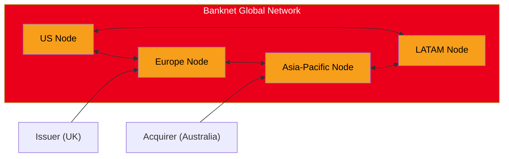

### Mastercard Decision Intelligence (AI Fraud)

| Feature | Detail |
|---------|--------|
| **Approach** | Generative AI scoring every transaction |
| **Data** | Analyzes billions of transactions from its network |
| **Result** | Claims 20% reduction in false declines |
| **Speed** | Real-time, sub-50ms scoring |

### Mastercard Key Products

| Product | Description |
|---------|-------------|
| **Mastercard Send** | Push payments to cards (equivalent to Visa Direct) |
| **Mastercard Track** | B2B payment platform for supplier management |
| **Ethoca** | Real-time alerts to prevent chargebacks before they happen |
| **NuData** | Behavioral biometrics for fraud prevention |
| **Open Banking APIs** | Through acquisition of Finicity/Aiia — PSD2/CDR data aggregation |
| **Mastercard Gateway** | Payment gateway (acquired from ANZ's Simplify Commerce) |

### Interchange Fee Structure (Visa & Mastercard in Australia)

The RBA regulates interchange in Australia:

| Card Type | Visa Interchange Cap | Mastercard Interchange Cap |
|-----------|---------------------|---------------------------|
| **Debit (contactless)** | Weighted avg ≤ $0.15 or 0.20% | Weighted avg ≤ $0.15 or 0.20% |
| **Credit (consumer)** | Weighted avg ≤ 0.50% | Weighted avg ≤ 0.50% |
| **Credit (commercial)** | Higher rates (less regulated) | Higher rates (less regulated) |
| **International** | Not capped by RBA | Not capped by RBA |

> **Why does interchange exist?** It incentivizes banks to **issue cards**. Without interchange revenue, banks would have no economic reason to give customers cards, provide fraud protection, or extend credit. The system only works if both issuing and acquiring sides have incentives.

---

## 9.4 UPI — India's Unified Payments Interface

### UPI at a Glance

| Fact | Detail |
|------|--------|
| **Launched** | April 2016 |
| **Operated by** | NPCI (National Payments Corporation of India) |
| **Built on** | IMPS (Immediate Payment Service) infrastructure |
| **Monthly transactions** | ~16 billion (2025) |
| **Monthly value** | ~₹20 lakh crore (~$250 billion/month) |
| **Cost to merchant** | 0% for transactions up to ₹2,000 (subsidized by government) |
| **Users** | ~350 million+ active users |
| **Key fact** | Processes more real-time payments than Visa + Mastercard combined |

> [!IMPORTANT]
> **Why UPI matters globally**: UPI is arguably the most successful digital payment system ever built. India went from a cash-dominated economy to processing 130+ billion digital transactions per year in under 8 years. Multiple countries are studying or adopting UPI's model.

### UPI Architecture

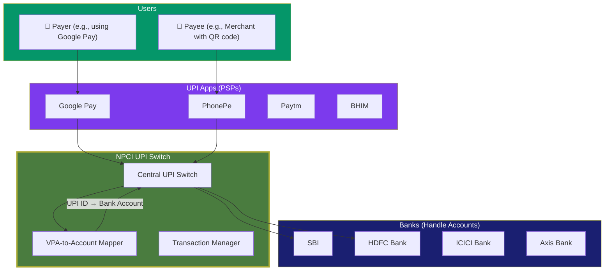

### How a UPI Payment Works (Step by Step)

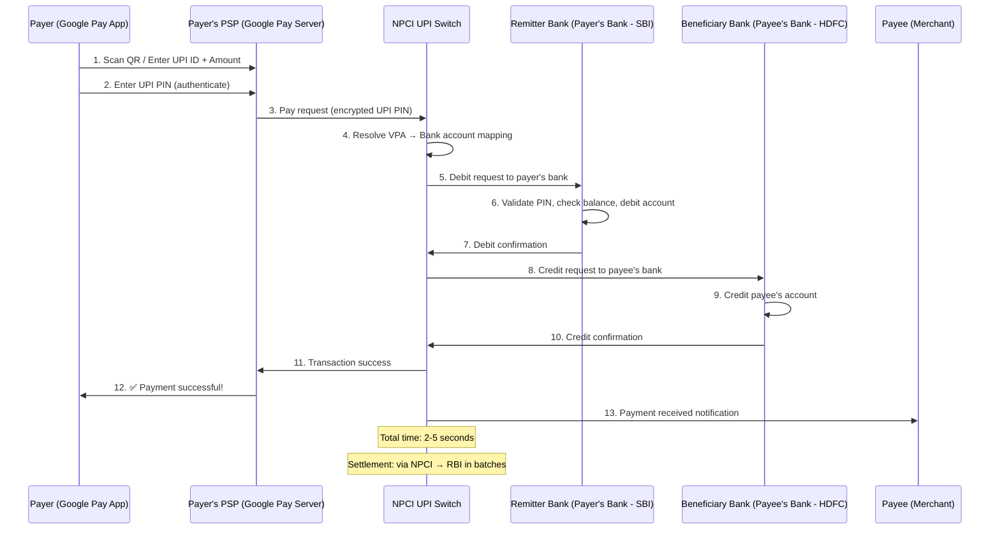

### UPI Key Concepts

| Concept | Explanation |
|---------|-------------|
| **VPA (Virtual Payment Address)** | A UPI ID like `samar@okicici` or `shop@ybl` — maps to a bank account without exposing the account number |
| **PSP (Payment Service Provider)** | The app layer — Google Pay, PhonePe, Paytm, BHIM. They don't hold money; they connect to NPCI |
| **NPCI** | National Payments Corporation of India — operates the UPI switch, sets rules, manages disputes |
| **UPI PIN** | 4-6 digit PIN set by user with their bank — used to authenticate every transaction |
| **Collect Request** | Payee sends a "request for payment" to payer (like a digital invoice) |
| **Pay Request** | Payer initiates push payment to payee |
| **QR Code** | Contains payee's VPA + amount — payer scans to pay |
| **Mandate** | Pre-authorized recurring payment (like direct debit) |
| **UPI Lite** | Offline small-value payments (under ₹500) — works without internet |
| **UPI 123PAY** | UPI for feature phones via IVR (voice-based) |

### UPI's Layered Architecture

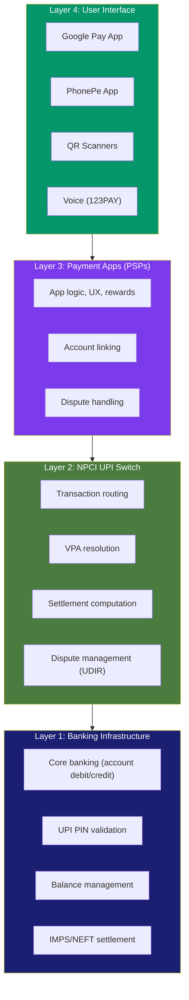

### UPI Settlement

Unlike NPP (Australia), UPI **does not settle in real-time**. It uses **deferred net settlement**:

| Aspect | Detail |
|--------|--------|
| **Settlement cycles** | Multiple batches per day (every 2–4 hours) |
| **Settlement agency** | RBI (Reserve Bank of India) |
| **Process** | NPCI calculates net positions between all banks, then settles through RBI |
| **Credit guarantee** | Even though settlement is deferred, the payee gets **instant credit** — the beneficiary bank takes on settlement risk |

### UPI's Global Expansion

| Country | Status | Partner |
|---------|--------|---------|
| **Singapore** | Live (UPI-PayNow linkage) | MAS + RBI |
| **UAE** | Live | NPCI International |
| **France** | Live | Lyra Network |
| **Sri Lanka** | Live | NPCI International |
| **Nepal** | Live | NPCI International + Fonepay |
| **Bhutan** | Live | RMA (Royal Monetary Authority) |
| **Malaysia** | In progress | — |
| **Australia** | Exploring | — |

---

## 9.5 SEPA — Europe's Single Payment Area

### SEPA at a Glance

| Fact | Detail |
|------|--------|
| **Full name** | Single Euro Payments Area |
| **Launched** | 2008 (credit transfers), 2009 (direct debits) |
| **Governed by** | European Payments Council (EPC) |
| **Countries** | 36 (EU + EEA + Switzerland + UK) |
| **Currency** | EUR (euro-denominated only) |
| **Key principle** | Cross-border EUR payments treated same as domestic |
| **Account identifier** | IBAN (International Bank Account Number) |

### SEPA Payment Schemes

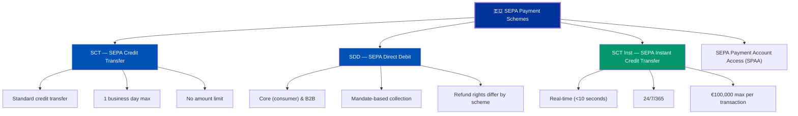

### IBAN Structure

```
DE89 3704 0044 0532 0130 00
│  │  │         │
│  │  │         └── Account number (BBAN — Basic Bank Account Number)
│  │  └──────────── Bank code (BLZ in Germany)
│  └─────────────── Check digits (89 — validates the IBAN)
└────────────────── Country code (DE = Germany)
```

| Country | IBAN Length | Example |
|---------|-----------|---------|
| **Germany** | 22 characters | DE89 3704 0044 0532 0130 00 |
| **UK** | 22 characters | GB29 NWBK 6016 1331 9268 19 |
| **France** | 27 characters | FR76 3000 6000 0112 3456 7890 189 |
| **Australia** | Does not use IBAN | Uses BSB + Account Number |

### SEPA Instant (SCT Inst) vs Standard

| Feature | SCT (Standard) | SCT Inst (Instant) |
|---------|---------------|-------------------|
| **Speed** | Up to 1 business day | <10 seconds |
| **Availability** | Business days only | 24/7/365 |
| **Max amount** | No limit | €100,000 (increasing to €200,000) |
| **Settlement** | DNS (end of day) | Real-time via TIPS or RT1 |
| **Adoption** | Universal (all SEPA banks) | ~60% of SEPA banks (mandatory from Jan 2025 per EU regulation) |

### PSD2 / Open Banking in Europe

| Aspect | Detail |
|--------|--------|
| **Full name** | Payment Services Directive 2 |
| **Effective** | January 2018 |
| **Key provisions** | Banks must provide APIs for account data and payment initiation |
| **TPP types** | AISP (Account Information), PISP (Payment Initiation) |
| **Authentication** | SCA (Strong Customer Authentication) mandatory |
| **Impact** | Enabled fintechs like Revolut, Wise, Plaid Europe |

---

## 9.6 PIX — Brazil's Instant Payment System

### PIX at a Glance

| Fact | Detail |
|------|--------|
| **Launched** | November 2020 |
| **Operated by** | BCB (Banco Central do Brasil — Brazilian Central Bank) |
| **Monthly transactions** | ~5 billion |
| **Users** | ~165 million (in a country of 215 million!) |
| **Cost** | Free for individuals, near-zero for businesses |
| **Speed** | <10 seconds, 24/7/365 |
| **Key fact** | 77% of Brazilians have used PIX — fastest adoption in payment history |

### How PIX Works

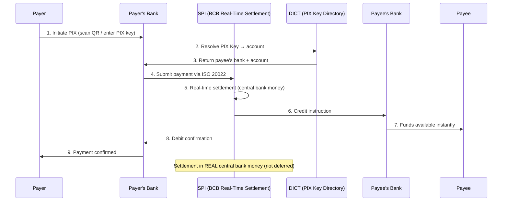

### PIX Keys (Addressing)

| Key Type | Example | Similar to |
|----------|---------|-----------|
| **CPF** (tax ID) | 123.456.789-00 | Like Aadhaar in India |
| **CNPJ** (business ID) | 12.345.678/0001-00 | Like ABN in Australia |
| **Email** | user@email.com | Like PayID email |
| **Phone** | +55 11 98765-4321 | Like PayID phone |
| **Random key** | a1b2c3d4-e5f6-... | UUID for privacy |

### What Makes PIX Special

| Feature | PIX | Most Other Systems |
|---------|-----|-------------------|
| **Settlement** | Real-time in central bank money (true finality) | Deferred net settlement |
| **Cost** | Free for consumers, mandated by central bank | Often charges/interchange |
| **Mandatory** | All banks with 500K+ accounts MUST participate | Voluntary for many systems |
| **Built by** | Central bank (not private sector) | Usually private consortium |
| **Rich data** | ISO 20022 native | Legacy formats common |
| **QR standards** | Standardized across all banks | Proprietary per app |

---

## 9.7 Faster Payments (UK)

### UK Faster Payments at a Glance

| Fact | Detail |
|------|--------|
| **Launched** | 2008 (one of the world's first real-time systems) |
| **Operated by** | Pay.UK (scheme) / Vocalink-Mastercard (infrastructure) |
| **Speed** | Near real-time (<2 seconds) |
| **Transaction limit** | £1,000,000 (individual bank limits may be lower) |
| **Availability** | 24/7/365 |
| **Monthly transactions** | ~370 million |

### UK Payment Landscape

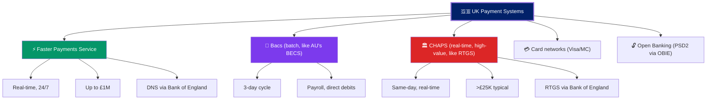

### UK Open Banking

The UK was a **pioneer in Open Banking** through the Open Banking Implementation Entity (OBIE):

| Milestone | Date | Impact |
|-----------|------|--------|
| CMA Order | 2016 | UK's 9 largest banks ordered to open APIs |
| PSD2 implementation | 2018 | EU-wide Open Banking regulation |
| Account data APIs | 2018 | AISPs can read bank data with consent |
| Payment initiation APIs | 2018 | PISPs can initiate payments from bank accounts |
| Variable Recurring Payments (VRP) | 2022 | Smart direct debits — variable amounts with consent |
| 10M+ users | 2024 | Widespread consumer adoption |

---

## 9.8 China — Alipay & WeChat Pay

### China's Digital Payment Ecosystem

China largely **leapfrogged** card networks. Instead of going cash → cards → digital, China went cash → **mobile super-apps**.

| Platform | Parent Company | Users | Founded | Model |
|----------|---------------|-------|---------|-------|
| **Alipay** | Ant Group (Alibaba) | ~1.3 billion | 2004 | Payment super-app |
| **WeChat Pay** | Tencent | ~900 million | 2013 | Embedded in WeChat messenger |
| **UnionPay** | State-owned | ~9 billion cards | 2002 | Card network (China's Visa) |

### How Alipay/WeChat Pay Work

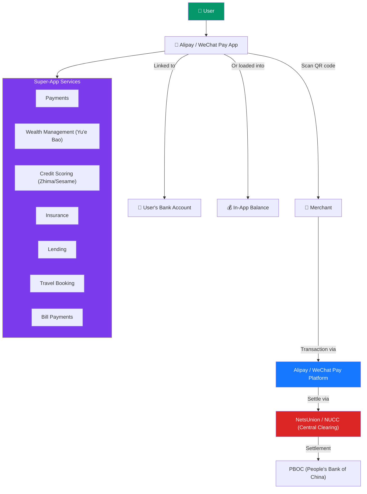

### Key Aspects

| Aspect | Detail |
|--------|--------|
| **QR codes** | The dominant payment method — merchant-presented or customer-presented |
| **NetsUnion (NUCC)** | Since 2018, all payments must clear through PBOC-controlled NetsUnion (not point-to-point) |
| **Regulation** | Heavy government oversight — platforms must keep user funds in regulated bank accounts |
| **Super-app model** | Alipay/WeChat aren't just payment apps — they're financial ecosystems with wealth management, credit, insurance |
| **Cross-border** | International tourists can now link foreign cards to Alipay/WeChat for payments in China |
| **Market share** | Alipay + WeChat Pay = ~90% of China's mobile payments |

### Why China's System Is Different

| Factor | China | Rest of World |
|--------|-------|--------------|
| **Card adoption** | Very low — most people skipped cards entirely | High (especially US, EU, AU) |
| **QR code dominance** | Universal — even street vendors have QR codes | Growing but card/NFC still dominant |
| **Platform power** | 2 platforms control 90% of digital payments | Fragmented — many providers |
| **Regulation** | Government mandated central clearing in 2018 | Various — some mandate, some don't |
| **Super-app** | Payments are just one feature of a super-app | Payments are usually standalone |

---

## 9.9 Comparison: Global Real-Time Payment Systems

### Head-to-Head Comparison

| Feature | UPI (India) | NPP (Australia) | PIX (Brazil) | FPS (UK) | SCT Inst (Europe) | FedNow (US) |
|---------|------------|-----------------|-------------|----------|-------------------|-------------|
| **Launched** | 2016 | 2018 | 2020 | 2008 | 2017 | 2023 |
| **Operator** | NPCI | NPP Australia | BCB | Pay.UK | EPC | Federal Reserve |
| **Speed** | 2–5 sec | <1 sec | <10 sec | <2 sec | <10 sec | <20 sec |
| **Availability** | 24/7 | 24/7 | 24/7 | 24/7 | 24/7 | 24/7 |
| **Transaction limit** | ₹1 lakh (~$1,200) | A$1M | No limit | £1M | €100K | $500K |
| **Settlement** | Deferred net | Near real-time (FSS) | Real-time (central bank) | Deferred net | Real-time (TIPS) or DNS | Real-time |
| **Cost (consumer)** | Free | Free | Free | Free | Free/low | Free/low |
| **Message standard** | Proprietary | ISO 20022 | ISO 20022 | ISO 8583 (migrating) | ISO 20022 | ISO 20022 |
| **Addressing** | VPA (UPI ID) | PayID | PIX Key | Sort code + account | IBAN | Account/routing |
| **Monthly txns** | ~16B | ~130M | ~5B | ~370M | ~500M | ~10M (growing) |
| **Adoption** | 350M+ users | ~20M users | 165M+ users | ~50M users | ~200M users | Growing |

### Architectural Patterns

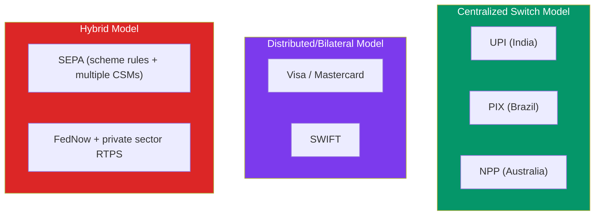

---

## 9.10 Cross-Border Payment Evolution

### The Cross-Border Problem Today

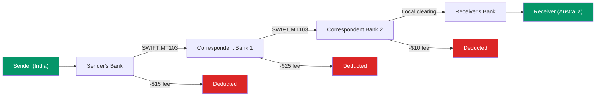

| Problem | Detail |
|---------|--------|
| **Slow** | 3–5 business days typical |
| **Expensive** | $15–$50+ in fees per transaction |
| **Opaque** | Sender doesn't know exact fees or arrival time |
| **Complex** | Multiple intermediary banks, each taking a cut |
| **FX spread** | Banks charge 1%–3% on currency conversion |

### The Solutions Emerging

| Solution | How It Works | Status |
|----------|-------------|--------|
| **RTP Linkages** | Link domestic real-time systems (e.g., UPI ↔ PayNow) | Live: India-Singapore, expanding |
| **SWIFT GPI** | Track payments end-to-end, same day in many cases | Live — 150+ banks |
| **Wise (TransferWise)** | Local accounts in each country — avoids SWIFT | Live — fintech disruptor |
| **Visa Direct / MC Send** | Push payment to any card in the world | Live — growing fast |
| **Project mBridge** | CBDC-based cross-border (BIS + multiple central banks) | Pilot |
| **Stablecoins** | USDC/USDT for near-instant cross-border transfer | Growing (regulatory uncertainty) |
| **ISO 20022 migration** | Richer data reduces friction and compliance cost | In progress — SWIFT deadline Nov 2025 |

### RTP Linkage Model (The Future)

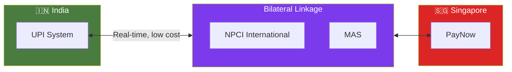

> **Vision**: Instead of routing through SWIFT and correspondent banks, each country's domestic real-time system connects directly to others. A person in India could send money to Someone in Singapore in seconds, at near-zero cost. This is already live for UPI-PayNow.

---

## 9.11 Key Takeaways

> [!IMPORTANT]
> **Core Concepts to Remember**:
> 1. **Visa/Mastercard are NOT banks** — they are technology companies that operate payment networks
> 2. Card transactions have **3 phases**: Authorization (real-time) → Clearing (batch) → Settlement (T+1/T+2)
> 3. **UPI** processes more real-time payments than Visa + Mastercard combined (130B+/year)
> 4. **PIX** achieved 77% population adoption in just 4 years — fastest in history
> 5. The world is moving toward **account-to-account** payments, reducing card network dependency
> 6. **Cross-border payments** are the last major friction point — RTP linkages and ISO 20022 are solving this
> 7. **China leapfrogged cards** entirely — super-apps (Alipay/WeChat) dominate

### Common Vocabulary from This Module

| Term | Definition |
|------|-----------|
| **VisaNet** | Visa's global transaction processing network |
| **Banknet** | Mastercard's distributed global processing network |
| **ISO 8583** | Message standard used for card authorization (binary format) |
| **UPI** | Unified Payments Interface — India's real-time payment system |
| **VPA** | Virtual Payment Address — UPI ID like `user@bank` |
| **NPCI** | National Payments Corporation of India — operates UPI |
| **PSP** | Payment Service Provider — app layer in UPI (Google Pay, PhonePe) |
| **PIX** | Brazil's instant payment system operated by the central bank |
| **SEPA** | Single Euro Payments Area — 36 European countries |
| **SCT Inst** | SEPA Instant Credit Transfer — real-time euro payments |
| **IBAN** | International Bank Account Number — standard account identifier in Europe |
| **PSD2** | Payment Services Directive 2 — EU Open Banking regulation |
| **3D Secure** | Authentication protocol for online card payments (Visa Secure / MC Identity Check) |
| **Interchange** | Fee paid by acquirer to issuer on every card transaction |
| **MCC** | Merchant Category Code — classifies the type of merchant business |
| **RTP Linkage** | Connecting two countries' real-time payment systems directly |
| **NetsUnion** | China's centralized clearing platform for mobile payments |

---

**Previous**: [← Module 08 — Banking Glossary](./08-banking-glossary.md)  
**Back to Index**: [← README](./README.md)
