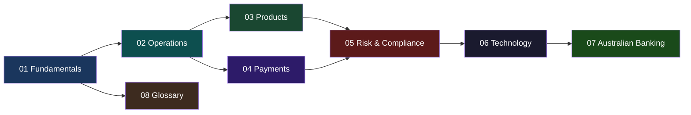

# 🏦 Banking Domain Knowledge Base

> A comprehensive learning resource for software engineers working in the banking & financial services industry.
> Designed for engineers at **NAB Innovation Centre** who want to deeply understand banking domain concepts, vocabulary, processes, and architecture.

---

## 📚 Learning Modules

| Module | Topic | Description |
|--------|-------|-------------|
| [01](./01-banking-fundamentals.md) | **Banking Fundamentals** | How banks work, types of banks, revenue models, balance sheets |
| [02](./02-core-banking-operations.md) | **Core Banking Operations** | Accounts, deposits, lending, ledgers, settlements |
| [03](./03-banking-products-services.md) | **Banking Products & Services** | Retail, commercial, investment, wealth management products |
| [04](./04-payment-systems-networks.md) | **Payment Systems & Networks** | SWIFT, RTGS, NPP, card networks, ISO 20022 |
| [05](./05-risk-management-compliance.md) | **Risk Management & Compliance** | KYC, AML, Basel III/IV, PCI-DSS, three lines of defence |
| [06](./06-banking-technology-architecture.md) | **Banking Technology & Architecture** | Core banking, APIs, microservices, cloud, Open Banking |
| [07](./07-australian-banking-nab.md) | **Australian Banking & NAB** | Big 4, RBA, APRA, NPP, CDR, Royal Commission |
| [08](./08-banking-glossary.md) | **Banking Glossary** | 200+ terms with definitions, organized by category |

---

## 🗺️ Learning Path

> **Recommended approach**: Start with Module 01 and work through sequentially. Use Module 08 (Glossary) as a reference throughout your learning journey.

---

## 🎯 Who Is This For?

- Software engineers transitioning into banking/fintech
- Technical consultants working with banking clients
- Innovation team members needing domain fluency
- Anyone who wants to speak the language of banking confidently

---

## 📖 How to Use This Knowledge Base

1. **Sequential Learning** — Work through modules 01→07 for a complete understanding
2. **Reference Mode** — Jump to specific modules when you need to understand a particular topic
3. **Glossary First** — Start with Module 08 if you're hearing terms you don't understand
4. **Deep Dive** — Each module has expandable sections with deeper technical details

---

*Created for the NAB Innovation Centre engineering team. Last updated: March 2026.*
